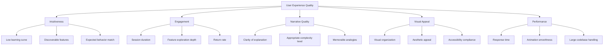
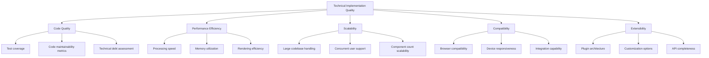

# Super Simple Code Framework Visualizer - Evaluation Criteria

This document establishes comprehensive criteria for evaluating the effectiveness and success of the Super Simple Code Framework Visualizer system. These metrics will guide ongoing development and measure the system's ability to achieve its core objective: making complex code understandable to users of all technical levels.

## Core Evaluation Dimensions

### 1. Comprehension Effectiveness

**Definition:** How well users understand code structure and functionality after using the visualization system.

```mermaid
graph TD
    A[Comprehension Effectiveness] --> B[Technical Accuracy]
    A --> C[Metaphor Clarity]
    A --> D[Relationship Understanding]
    A --> E[Functional Understanding]
    A --> F[Knowledge Retention]
    
    B --> B1[Code structure accurately represented]
    B --> B2[No critical omissions in modeling]
    B --> B3[Relationships correctly mapped]
    
    C --> C1[Intuitive building block analogies]
    C --> C2[Consistent metaphor application]
    C --> C3[Metaphor matches actual code behavior]
    
    D --> D1[Component dependency clarity]
    D --> D2[Interaction flow comprehension]
    D --> D3[Data flow understanding]
    
    E --> E1[Purpose understanding]
    E --> E2[Process sequence comprehension]
    E --> E3[System boundaries recognition]
    
    F --> F1[Recall after time period]
    F --> F2[Application to similar structures]
    F --> F3[Explanation to others capability]
```



**Measurement Methods:**
- Pre/post comprehension tests
- User explanations of code functionality
- Timing tasks requiring code structure understanding
- Self-reported comprehension ratings
- Application of knowledge in related coding tasks

**Target Success Criteria:**
- 80% of users show measurable improvement in understanding
- Junior developers show 50% faster comprehension of new codebases
- Non-technical users can explain basic system functionality with 70% accuracy

### 2. User Experience Quality

**Definition:** The quality of interaction with the system across different user types and scenarios.



**Measurement Methods:**
- System Usability Scale (SUS) surveys
- Interaction analytics (clicks, paths, feature usage)
- A/B testing of different UI approaches
- User sentiment analysis
- Task completion time and success rate

**Target Success Criteria:**
- SUS score above 80 (above industry average)
- Average session duration exceeding 10 minutes
- 70% of features discovered and used within first 3 sessions
- Return usage rate of 65% within first month

### 3. Technical Implementation Quality

**Definition:** The robustness, maintainability, and scalability of the system implementation.



**Measurement Methods:**
- Automated code quality metrics
- Performance profiling
- Load testing with varying codebase sizes
- Cross-browser/device testing
- Code review assessments

**Target Success Criteria:**
- Test coverage exceeding 80%
- Processing time under 30 seconds for 100K LOC
- Support for codebases up to 1M LOC with performance degradation under 200%
- Consistent rendering across all major browsers and devices

### 4. Educational Effectiveness

**Definition:** The system's value as a learning and teaching tool for code concepts.

```mermaid
graph TD
    A[Educational Effectiveness] --> B[Concept Clarity]
    A --> C[Learning Progression]
    A --> D[Knowledge Transfer]
    A --> E[Teaching Utility]
    A --> F[Retention Impact]
    
    B --> B1[Abstract concept explanation]
    B --> B2[Technical term introduction]
    B --> B3[Pattern recognition]
    
    C --> C1[Scaffolded learning support]
    C --> C2[Complexity progression]
    C --> C3[Self-assessment accuracy]
    
    D --> D1[Peer explanation quality]
    D --> D2[Applied knowledge]
    D --> D3[Cross-domain transfer]
    
    E --> E1[Classroom integration]
    E --> E2[Supplemental material quality]
    E --> E3[Instructor efficiency]
    
    F --> F1[Long-term recall]
    F --> F2[Conceptual foundation]
    F --> F3[Advanced topic preparation]
```



**Measurement Methods:**
- Learning assessments before/after system use
- Educator feedback on teaching value
- Student performance on programming tasks
- Qualitative assessment of explanation quality
- Long-term retention testing

**Target Success Criteria:**
- 40% improvement in code concept understanding
- 90% of educators report valuable teaching assistance
- Positive correlation between system usage and programming assessment scores
- Successfully used as primary teaching tool in at least 5 educational contexts

### 5. Business Value

**Definition:** The practical value delivered to organizations and teams using the system.

```mermaid
graph TD
    A[Business Value] --> B[Onboarding Efficiency]
    A --> C[Cross-team Collaboration]
    A --> D[Documentation Enhancement]
    A --> E[Decision Support]
    A --> F[Maintenance Efficiency]
    
    B --> B1[Time to productivity]
    B --> B2[Training resource reduction]
    B --> B3[Self-service capability]
    
    C --> C1[Technical/non-technical communication]
    C --> C2[Shared understanding metrics]
    C --> C3[Collaborative decision improvement]
    
    D --> D1[Documentation completeness]
    D --> D2[Documentation accuracy]
    D --> D3[Documentation maintenance effort]
    
    E --> E1[Architectural decision speed]
    E --> E2[Impact assessment accuracy]
    E --> E3[Risk identification]
    
    F --> F1[Bug location efficiency]
    F --> F2[Refactoring planning]
    F --> F3[Technical debt visualization]
```



**Measurement Methods:**
- Time-to-productivity metrics for new team members
- Cross-functional meeting effectiveness surveys
- Documentation coverage and quality metrics
- Decision cycle time measurements
- Maintenance task time tracking

**Target Success Criteria:**
- 30% reduction in new developer onboarding time
- 25% improvement in technical/non-technical communication effectiveness
- 40% increase in documentation coverage and currency
- 20% reduction in architectural decision time

## Evaluation Implementation Plan

### Phase 1: Baseline Establishment

1. **Pre-Implementation Metrics Collection**
   - Audit current code comprehension methods and effectiveness
   - Measure existing onboarding times and effectiveness
   - Assess current documentation quality and coverage
   - Conduct initial user surveys on pain points

2. **Test Group Formation**
   - Establish control and experimental groups
   - Include diverse skill levels and roles
   - Create standardized tasks for comparison

### Phase 2: Incremental Evaluation

1. **MVP Evaluation (Basic Visualization)**
   - Focus on core comprehension metrics
   - Simple A/B tests comparing with traditional documentation
   - Usability evaluations with think-aloud protocols

2. **Enhanced Features Evaluation**
   - Measure impact of narrative addition
   - Assess value of interactive features
   - Evaluate learning curve and discovery patterns

### Phase 3: Comprehensive Assessment

1. **Multi-Dimensional Evaluation**
   - Deploy all evaluation instruments across dimensions
   - Collect quantitative and qualitative data
   - Compare against baseline and targets

2. **Longitudinal Studies**
   - Track long-term impact on teams and organizations
   - Measure knowledge retention over time
   - Assess ongoing usage patterns and value delivery

### Phase 4: Continuous Improvement

1. **Feedback Integration Process**
   - Establish channels for user-identified improvements
   - Create priority matrix for enhancement decisions
   - Implement metrics-driven feature prioritization

2. **Regular Reassessment**
   - Quarterly evaluation against key metrics
   - Annual comprehensive assessment
   - Competitive benchmarking

## Evaluation Instruments

### 1. Comprehension Assessment Test

A standardized test measuring code understanding before and after system use:

```
Example Questions:
1. Identify the main components in this system
2. Explain how Component A interacts with Component B
3. What happens when Function X is called?
4. Draw a diagram showing the data flow between modules
5. What would be affected if Component C were modified?
```

### 2. User Experience Survey

A structured survey based on the System Usability Scale with additional visualization-specific questions:

```
Example Questions (1-5 Likert scale):
1. I found the building block metaphors intuitive
2. I could easily identify relationships between components
3. The narrative explanations enhanced my understanding
4. I could navigate through the visualization easily
5. I would use this system regularly in my work
```

### 3. Time-on-Task Measurements

Structured tasks with time measurement to assess efficiency improvements:

```
Example Tasks:
1. Locate where user authentication happens in the codebase
2. Identify all components that interact with the database
3. Determine the execution path for feature X
4. Find potential bottlenecks in process Y
5. Explain system architecture to a new team member
```

### 4. Qualitative Assessment Guide

Framework for semi-structured interviews and qualitative feedback:

```
Example Topics:
1. Most valuable insights gained from visualization
2. Conceptual gaps or confused areas
3. Comparison with previous understanding methods
4. Suggestions for metaphor improvements
5. Narrative effectiveness and clarity
```

### 5. Business Impact Tracking Form

Template for documenting tangible business outcomes:

```
Example Metrics:
1. Developer onboarding time (before/after)
2. Time spent explaining code to non-technical stakeholders
3. Decision cycle time for architecture changes
4. Bug localization time
5. Documentation maintenance effort
```

## Visualization-Specific Metrics

### 1. Visualization Accuracy Index

**Calculation:** (Correctly represented components + relationships) / Total components and relationships × 100%

**Target:** >95% accuracy

### 2. Metaphor Effectiveness Score

**Calculation:** Average of user ratings (1-10) on how well metaphors (houses, people, toys) represent actual code concepts

**Target:** >8/10 average rating

### 3. Narrative Clarity Index

**Calculation:** (Clear explanations / Total explanations) based on user feedback

**Target:** >85% clarity rating

### 4. Interaction Engagement Score

**Calculation:** (Features used / Total features available) × (Average time per feature / Expected time per feature)

**Target:** >0.7 engagement score

### 5. Cross-Role Comprehension Delta

**Calculation:** (Non-technical comprehension with system / Developer comprehension with system) × 100%

**Target:** >70% ratio

## Conclusion

This evaluation framework provides a comprehensive approach to assessing the Super Simple Code Framework Visualizer across multiple dimensions. By establishing clear metrics, measurement methods, and success criteria, we can systematically evaluate the system's effectiveness in achieving its primary goal: making complex code understandable to users of all technical levels through an intuitive, narrative-driven visualization approach.

The evaluation plan balances quantitative metrics with qualitative assessment, recognizing that both objective measurements and subjective user experience are essential for a complete understanding of the system's value. By implementing this evaluation framework throughout the development process, we can ensure the visualization system delivers maximum value to all stakeholders while continuously improving based on evidence-based insights.