# The Agents Wing - Memory Palace Room

*As you enter the Agents Wing of your Document Unification System memory palace, you find yourself in an elegant building with multiple training rooms and offices. This central facility is where all the system's agents are trained and managed.*

## Room Layout

```mermaid
graph TD
    classDef foundation fill:#f9f9f9,stroke:#333,stroke-width:3px
    classDef enhanced fill:#e1f5fe,stroke:#333,stroke-width:2px
    classDef specialized fill:#e8f5e9,stroke:#333,stroke-width:1px
    classDef orchestrator fill:#fff3e0,stroke:#333,stroke-width:2px
    
    Entrance[Main Entrance Hall] --> TrainingCenter[Agent Training Center]
    Entrance --> OrchestratorOffice[Orchestrator's Office]
    
    TrainingCenter --> BaseFacility[Base Agent Facility]
    TrainingCenter --> EnhancedFacility[Enhanced Agent Academy]
    
    BaseFacility --> BaseTraining[Basic Training Room]
    BaseFacility --> BaseGear[Basic Agent Equipment]
    
    EnhancedFacility --> LifecycleTrack[Lifecycle Training Track]
    EnhancedFacility --> MessagingDojo[Messaging Dojo]
    EnhancedFacility --> StateManagement[State Management Lab]
    
    OrchestratorOffice --> CommandCenter[Command and Control Center]
    OrchestratorOffice --> WorkflowPlanner[Workflow Planning Room]
    OrchestratorOffice --> AgentDispatch[Agent Dispatch Station]
    
    TrainingCenter --> SpecialistWing[Specialist Wing]
    
    SpecialistWing --> ParserAgent[Parser Agent Office]
    SpecialistWing --> MetadataAgent[Metadata Agent Office]
    SpecialistWing --> ValidatorAgent[Validator Agent Office]
    SpecialistWing --> CodeBuilding[Code Building Department]
    
    class Entrance foundation
    class TrainingCenter foundation
    class BaseFacility foundation
    class BaseTraining foundation
    class BaseGear foundation
    
    class EnhancedFacility enhanced
    class LifecycleTrack enhanced
    class MessagingDojo enhanced
    class StateManagement enhanced
    
    class OrchestratorOffice orchestrator
    class CommandCenter orchestrator
    class WorkflowPlanner orchestrator
    class AgentDispatch orchestrator
    
    class SpecialistWing specialized
    class ParserAgent specialized
    class MetadataAgent specialized
    class ValidatorAgent specialized
    class CodeBuilding specialized
```

## Main Entrance Hall

As you first enter the Agents Wing, you notice a grand entrance hall with a large directory board showing all the agents in the system. The flooring is made of polished stone with the BaseAgent emblem embedded in it - this reminds you that **all agents inherit from BaseAgent**.

*Memory hook: The foundation stone with BaseAgent emblem reminds you that `src/agents/base_agent.py` is the foundation class for all agents.*

On the walls are portraits of various agents in action, with nameplates describing their specialties. A large banner reads "Serving the Document Unification Process with Specialized Skills."

## Agent Training Center

### Base Agent Facility

The first room on your left is a basic training facility with simple equipment. New agent recruits practice fundamental skills here:

- **Logging Station**: Agents learn to maintain detailed logs of their activities
- **Communication Basics**: Simple message handling and responses
- **Basic State Board**: A simple whiteboard tracking agent state

*Memory hook: The simple equipment reminds you that BaseAgent has only basic capabilities like logging, simple communication, and minimal state.*

### Enhanced Agent Academy

Proceeding further, you enter a more advanced facility with sophisticated training equipment:

- **Lifecycle Track**: A circular track where agents practice the initialize → process → finalize sequence
- **Messaging Dojo**: Advanced communication training with complex message patterns
- **State Management Lab**: High-tech facility for tracking complex state transitions

*Memory hook: The advanced equipment reminds you that EnhancedBaseAgent extends BaseAgent with lifecycle methods, advanced messaging, and sophisticated state management in `src/agents/enhanced_base_agent.py`.*

## Orchestrator's Office

Across from the training center is an impressive office complex with a commanding view of the entire wing.

### Command and Control Center

The central room has a large holographic display showing the status of all document processing activities. The Orchestrator (represented by a distinguished figure with a master key) coordinates all operations from here.

*Memory hook: The holographic display reminds you that OrchestratorAgent in `src/agents/orchestrator.py` has a complete view of all processing activities.*

### Workflow Planning Room

Adjacent to the command center is a room with elaborate planning tables and flowchart boards. Here, workflow sequences are designed and optimized.

*Memory hook: The planning tables remind you that WorkflowOrchestrator in `src/agents/workflow_orchestrator.py` designs and manages workflow sequences.*

### Agent Dispatch Station

A busy room with communication terminals where specialized agents receive their assignments and report their progress.

*Memory hook: The dispatch terminals remind you that the orchestrator delegates tasks to specialized agents.*

## Specialist Wing

The final section contains offices for specialized agents, each designed to reflect their function.

### Parser Agent Office

A room filled with document scanners, magnifying glasses, and text analysis tools. The agents here wear special glasses that allow them to "see into" documents.

*Memory hook: The analysis tools remind you that ParserAgent in `src/agents/parser_agent.py` extracts structured content from documents.*

### Metadata Agent Office

A highly organized room with card catalogs, indexes, and classification systems. Agents here are meticulously categorizing and tagging information.

*Memory hook: The cataloging systems remind you that MetadataAgent in `src/agents/metadata_agent.py` extracts and organizes document metadata.*

### Validator Agent Office

A quality control lab with testing equipment, verification protocols, and accuracy measurement tools. Agents here carefully examine documents for errors.

*Memory hook: The testing equipment reminds you that ValidatorAgent in `src/agents/validator_agent.py` verifies document accuracy and completeness.*

### Code Building Department

A large engineering department with blueprint tables, coding stations, and collaborative spaces. Multiple specialized agents work together on complex code creation.

*Memory hook: The engineering environment reminds you of the code building system in `src/agents/code_building_workflow.py` with its multiple specialized agents.*

## How to Use This Memory Palace Room

When recalling the agent system:

1. **Enter the main hall** - Remember the base agent foundation
2. **Visit the training centers** - Recall the progression from basic to enhanced agents
3. **Stop by the orchestrator's office** - Visualize the coordination process
4. **Tour the specialist offices** - Remember the specialized agent types

Each location contains visual hooks that remind you of specific code files and their functions within the agent system.

## Code File Mapping

| Room/Feature | Code File | Key Concept |
|--------------|-----------|-------------|
| Main Entrance Emblem | src/agents/base_agent.py | Foundation class for all agents |
| Enhanced Academy | src/agents/enhanced_base_agent.py | Advanced agent with lifecycle methods |
| Command Center | src/agents/orchestrator.py | Master orchestration of processing |
| Planning Room | src/agents/workflow_orchestrator.py | Workflow sequence management |
| Parser Office | src/agents/parser_agent.py | Document content extraction |
| Metadata Office | src/agents/metadata_agent.py | Metadata extraction and management |
| Validator Office | src/agents/validator_agent.py | Content validation |
| Code Building Dept | src/agents/code_building_workflow.py | Code generation workflow |