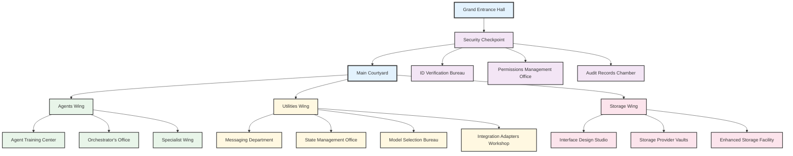

# Document Unification System Memory Palace

Welcome to the Document Unification System Memory Palace - a spatial memory technique that helps you learn and remember the system's architecture by associating components with physical locations in an imaginary building.

## The Memory Palace Approach

The Method of Loci (Memory Palace technique) works by:

1. Creating a vivid mental image of a physical location
2. Placing information at specific locations within that space
3. Mentally walking through the space to retrieve information
4. Using distinctive visual metaphors to make concepts memorable

This memory palace combines the Method of Loci with the Feynman technique (explaining complex concepts using simple analogies) to create a powerful learning tool.

## Palace Map

## Memory Rooms Available

1. [**Agents Wing**](./agents_wing.md) - Houses all the agent classes and types
   - Agent Training Center
   - Orchestrator's Office
   - Specialist Wing

2. [**Utilities Wing**](./utils_wing.md) - Contains support systems and infrastructure
   - Messaging Department
   - State Management Office
   - Model Selection Bureau
   - Integration Adapters Workshop

3. [**Storage Wing**](./storage_wing.md) - Manages document and data storage
   - Interface Design Studio
   - Storage Provider Vaults
   - Enhanced Storage Facility

4. [**Security Checkpoint**](./security_checkpoint.md) - Controls access and permissions
   - ID Verification Bureau
   - Permissions Management Office
   - Audit Records Chamber
   - Middleware Gateway Hub

## How to Use This Memory Palace

### For Learning the System

1. **Start at the entrance** and tour the palace in order
2. **Visit each room** and spend time visualizing the components
3. **Create associations** between the visual metaphors and code concepts
4. **Practice recalling** the system by mentally walking through the palace

### For Recalling Specific Components

1. **Go directly to the relevant wing** of the palace
2. **Locate the specific room** that houses the component
3. **Recall the visual metaphors** associated with that room
4. **Map the metaphors back** to the actual code components

## Key Metaphors and Their Meanings

| Metaphor | System Component | Code Location |
|----------|------------------|---------------|
| Agent Training Center | Agent class hierarchy | src/agents/base_agent.py, enhanced_base_agent.py |
| Orchestrator's Office | Workflow coordination | src/agents/orchestrator.py, workflow_orchestrator.py |
| Specialist Offices | Specialized agents | src/agents/parser_agent.py, metadata_agent.py, etc. |
| Messaging Department | Message system | src/utils/orchestration_messaging.py |
| State Management Office | Process state tracking | src/utils/orchestrator_state.py |
| Model Selection Bureau | LLM model selection | src/utils/llm_provider/model_selection_framework.py |
| Storage Provider Vaults | Storage implementations | src/storage/supabase_storage.py, s3_storage.py, etc. |
| Security Checkpoint | Authentication & authorization | src/auth/ directory |

## Memory Palace Construction Tips

1. **Add personal touches** to make locations more memorable to you
2. **Engage multiple senses** when visualizing rooms (sight, sound, smell, etc.)
3. **Make unusual or exaggerated associations** as they are easier to remember
4. **Practice the journey** regularly to strengthen memory
5. **Expand the palace** as you learn more about the system

Happy exploring! The more vividly you can imagine this palace, the better you'll remember the Document Unification System's architecture.