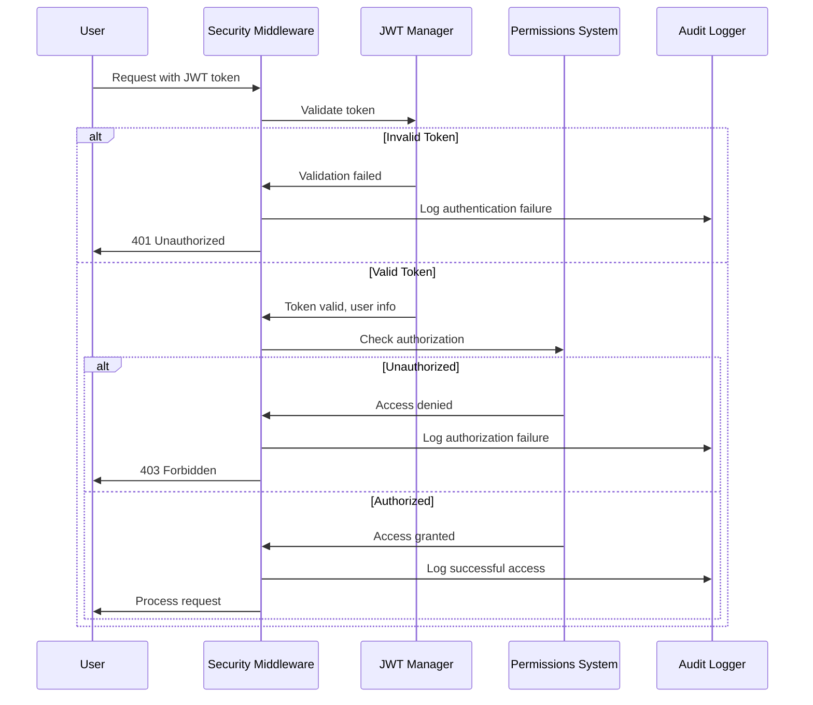

# The Security Checkpoint - Memory Palace Room

*Your journey through the Document Unification System memory palace now brings you to the Security Checkpoint. This fortified area controls access to the entire system and ensures only authorized users can perform specific actions.*

## Room Layout

```mermaid
graph TD
    classDef entry fill:#e3f2fd,stroke:#333,stroke-width:3px
    classDef jwt fill:#e8f5e9,stroke:#333,stroke-width:2px
    classDef permissions fill:#fff8e1,stroke:#333,stroke-width:2px
    classDef audit fill:#fce4ec,stroke:#333,stroke-width:1px
    classDef middleware fill:#f3e5f5,stroke:#333,stroke-width:2px
    
    Entrance[Security Wing Entrance] --> MainCheckpoint[Main Security Checkpoint]
    
    MainCheckpoint --> IDVerification[ID Verification Bureau]
    MainCheckpoint --> PermissionsOffice[Permissions Management Office]
    MainCheckpoint --> AuditChamber[Audit Records Chamber]
    MainCheckpoint --> GatewayHub[Middleware Gateway Hub]
    MainCheckpoint --> ClientServices[Client Connection Services]
    
    IDVerification --> JWTForge[JWT Token Forge]
    IDVerification --> TokenValidation[Token Validation Laboratory]
    IDVerification --> SecretVault[Secret Vault]
    
    PermissionsOffice --> RoleDefinition[Role Definition Library]
    PermissionsOffice --> AccessMatrix[Access Control Matrix Room]
    PermissionsOffice --> AuthorizationEngine[Authorization Engine]
    
    AuditChamber --> EventLogging[Event Logging Station]
    AuditChamber --> SecurityMonitoring[Security Monitoring Center]
    AuditChamber --> ComplianceArchive[Compliance Archive]
    
    GatewayHub --> RequestInterception[Request Interception Station]
    GatewayHub --> AuthenticationFilters[Authentication Filter Bank]
    GatewayHub --> RequestTransformation[Request Transformation Lab]
    
    ClientServices --> SupabaseConnection[Supabase Connection Terminal]
    
    class Entrance entry
    class MainCheckpoint entry
    
    class IDVerification jwt
    class JWTForge jwt
    class TokenValidation jwt
    class SecretVault jwt
    
    class PermissionsOffice permissions
    class RoleDefinition permissions
    class AccessMatrix permissions
    class AuthorizationEngine permissions
    
    class AuditChamber audit
    class EventLogging audit
    class SecurityMonitoring audit
    class ComplianceArchive audit
    
    class GatewayHub middleware
    class RequestInterception middleware
    class AuthenticationFilters middleware
    class RequestTransformation middleware
    
    class ClientServices,SupabaseConnection middleware
```

## Security Wing Entrance

The entrance to the Security Wing is a fortified gateway with reinforced doors and security scanners. Guards check credentials before allowing entry. A large security protocol poster details the authentication flow and security principles.

*Memory hook: The fortified entrance reminds you that `src/auth/` contains the security components that protect the entire system.*

The walls are adorned with security certificates and compliance badges, demonstrating adherence to security standards.

## Main Security Checkpoint

The central hub of the security wing with multiple security stations and monitoring screens. Security personnel monitor all system access and manage security operations.

*Memory hook: The central checkpoint reminds you that authentication is a centralized service in the system.*

## ID Verification Bureau

A dedicated section for validating user identities and issuing secure credentials.

### JWT Token Forge

A high-security facility where JWT tokens are crafted with specialized equipment. The tokens contain embedded identity information, expiration timestamps, and cryptographic signatures.

*Memory hook: The token forge reminds you of token creation in `src/auth/jwt_manager.py`.*

### Token Validation Laboratory

A verification facility where tokens are carefully examined to ensure authenticity. Specialized equipment checks signatures, expiration dates, and token integrity.

*Memory hook: The validation equipment reminds you of token verification in `src/auth/jwt_manager.py`.*

### Secret Vault

A highly secure vault where cryptographic keys and secrets are stored. Access requires multiple authorization levels and biometric verification.

*Memory hook: The secure vault reminds you of secret management for JWT operations.*

## Permissions Management Office

An administrative office managing authorization rules and access controls.

### Role Definition Library

A library containing detailed descriptions of all system roles. Each role is documented with its responsibilities and access rights.

*Memory hook: The role documentation reminds you of role definitions in `src/auth/permissions.py`.*

### Access Control Matrix Room

A room with a large matrix display showing which roles can access which resources. Security administrators configure access patterns here.

*Memory hook: The access matrix reminds you of permission checking in `src/auth/permissions.py`.*

### Authorization Engine

A control room where authorization decisions are made based on user identity and requested actions. The engine applies role-based rules to grant or deny access.

*Memory hook: The decision engine reminds you of the authorization logic in the permissions system.*

## Audit Chamber

A secure facility where all security-related events are recorded and monitored.

### Event Logging Station

A facility with continuous-feed printers and digital recorders capturing every security event. Each authentication, authorization, and security action is timestamped and recorded.

*Memory hook: The logging equipment reminds you of security event logging in `src/auth/audit.py`.*

### Security Monitoring Center

A monitoring room with dashboards showing security metrics, unusual activity alerts, and system health. Security analysts monitor for potential threats.

*Memory hook: The monitoring dashboards remind you of security monitoring capabilities.*

### Compliance Archive

A long-term storage facility where audit records are preserved for compliance purposes. Records are organized chronologically with tamper-evident seals.

*Memory hook: The compliance archive reminds you of audit record retention in the authentication system.*

## Middleware Gateway Hub

A technical facility managing the integration of security services with application requests.

### Request Interception Station

An interception facility where incoming requests are captured and examined before processing. Each request is inspected for security credentials.

*Memory hook: The interception station reminds you of request handling in `src/auth/middleware.py`.*

### Authentication Filter Bank

A series of security filters that incoming requests must pass through. Each filter checks a specific security aspect before allowing the request to proceed.

*Memory hook: The filter bank reminds you of authentication middleware filters.*

### Request Transformation Lab

A technical laboratory where requests are modified to include security context after successful authentication. Technicians add user identity and permission data to requests.

*Memory hook: The transformation lab reminds you of request enrichment in the middleware.*

## Client Connection Services

A specialized facility managing connections to external authentication services.

### Supabase Connection Terminal

A communication center with direct links to Supabase authentication services. Operators manage the connection and synchronize identity information.

*Memory hook: The Supabase terminal reminds you of `src/auth/supabase_client.py`.*

## Authentication Flow Visualization

## Security Components Relationship

The security system components work together as a cohesive unit:

| Component | Relationship | Visualization |
|-----------|--------------|---------------|
| JWT Manager | Creates and validates tokens | Token forge creating secure passes |
| Permissions | Checks access rights | Guards checking access lists |
| Middleware | Intercepts requests | Security checkpoint screening visitors |
| Audit | Records all security events | Scribes recording all security activities |
| Supabase Client | Connects to external auth | Ambassador to external security alliance |

## How to Use This Memory Palace Room

When recalling the authentication system:

1. **Enter the security wing** - Remember the overall security architecture
2. **Visit the ID verification bureau** - Recall JWT token management
3. **Explore the permissions office** - Visualize authorization controls
4. **Tour the audit chamber** - Remember security logging
5. **Examine the middleware hub** - Recall request processing
6. **Check the client services** - Remember external integrations

Each location contains visual hooks that remind you of specific code files and their functions within the security system.

## Code File Mapping

| Room/Feature | Code File | Key Concept |
|--------------|-----------|-------------|
| JWT Token Forge | src/auth/jwt_manager.py | Token creation and signing |
| Token Validation Lab | src/auth/jwt_manager.py | Token verification |
| Role Definition Library | src/auth/permissions.py | Role and permission definitions |
| Access Control Matrix | src/auth/permissions.py | Permission checking logic |
| Event Logging Station | src/auth/audit.py | Security event logging |
| Request Interception | src/auth/middleware.py | Request authentication |
| Supabase Connection | src/auth/supabase_client.py | External auth service integration |