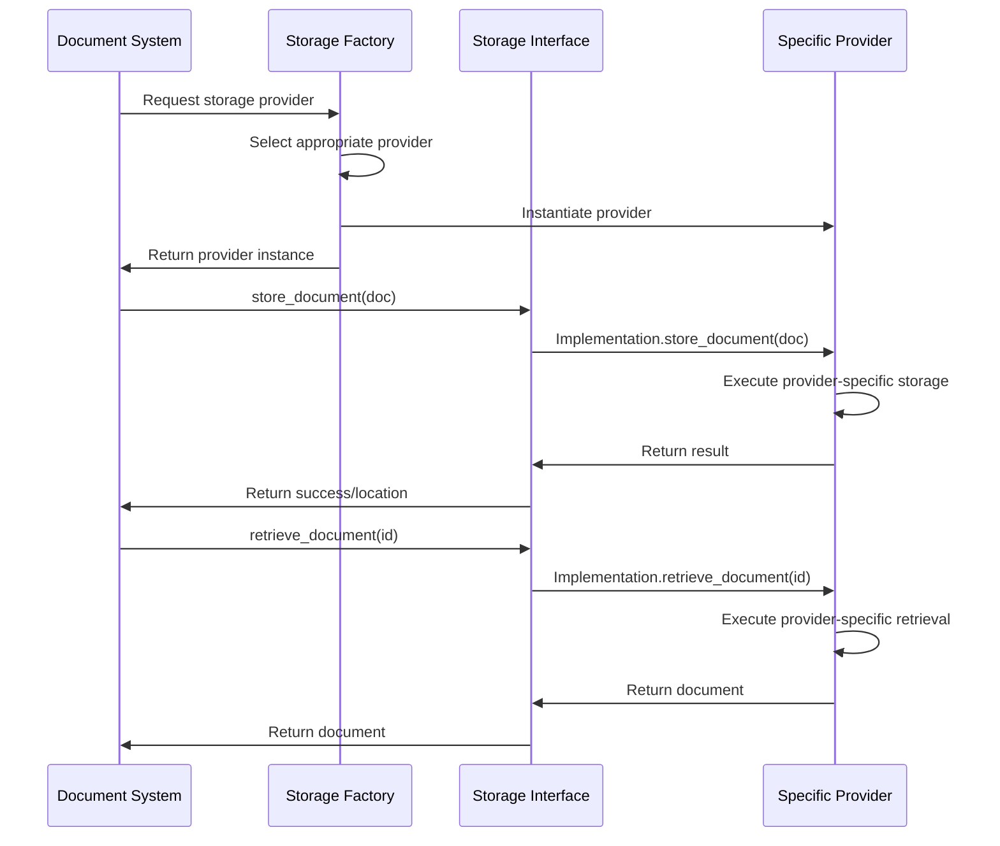

# The Storage Wing - Memory Palace Room

*Continuing your journey through the Document Unification System memory palace, you follow signs to the Storage Wing. As you enter, you feel a cool, climate-controlled atmosphere designed to preserve important information for the long term.*

## Room Layout

```mermaid
graph TD
    classDef interface fill:#e3f2fd,stroke:#333,stroke-width:2px
    classDef implementation fill:#e8f5e9,stroke:#333,stroke-width:1px
    classDef enhanced fill:#fff8e1,stroke:#333,stroke-width:2px
    classDef factory fill:#fce4ec,stroke:#333,stroke-width:1px
    
    Entrance[Storage Wing Entrance] --> AdminOffice[Storage Administration]
    Entrance --> InterfaceDesign[Interface Design Studio]
    Entrance --> ProviderWing[Storage Provider Wing]
    Entrance --> EnhancedFacility[Enhanced Storage Facility]
    
    AdminOffice --> FactoryRoom[Provider Factory Room]
    AdminOffice --> ConfigurationOffice[Configuration Management]
    
    InterfaceDesign --> BaseInterface[Base Interface Blueprint Room]
    InterfaceDesign --> ContractDesign[Storage Contract Design]
    
    ProviderWing --> SupabaseVault[Supabase Vault]
    ProviderWing --> S3Warehouse[S3 Warehouse]
    ProviderWing --> LocalArchive[Local Archive]
    
    EnhancedFacility --> OptimizedRoom[Optimized Storage Laboratory]
    EnhancedFacility --> ExtendedCapabilities[Extended Capabilities Center]
    
    class Entrance interface
    class AdminOffice factory
    class InterfaceDesign interface
    class ProviderWing implementation
    class EnhancedFacility enhanced
    
    class FactoryRoom factory
    class ConfigurationOffice factory
    
    class BaseInterface interface
    class ContractDesign interface
    
    class SupabaseVault implementation
    class S3Warehouse implementation
    class LocalArchive implementation
    
    class OptimizedRoom enhanced
    class ExtendedCapabilities enhanced
```

## Storage Wing Entrance

As you enter the Storage Wing, you're greeted by a grand foyer with different archways leading to specialized storage areas. A large mosaic on the floor depicts the Storage Interface blueprint - the fundamental design that all storage implementations follow.

*Memory hook: The mosaic blueprint reminds you that `src/storage/storage_interface.py` defines the core interface all storage providers implement.*

Information kiosks provide details about different storage options, their characteristics, and appropriate use cases.

## Storage Administration

To your right is an administrative office overseeing all storage operations.

### Provider Factory Room

A control room with a switchboard allowing operators to select and configure different storage providers based on requirements. A large decision tree diagram shows the selection logic.

*Memory hook: The provider selection switchboard reminds you of `src/storage/storage_provider_factory.py` which creates appropriate storage provider instances.*

### Configuration Management

An office with filing cabinets containing configuration profiles for different storage providers. Staff here ensure each provider has the correct settings for optimal operation.

*Memory hook: The configuration profiles remind you of the storage configuration settings used across providers.*

## Interface Design Studio

To your left is a design studio where the fundamental storage interfaces are created and refined.

### Base Interface Blueprint Room

A drafting room with large technical drawings showing the base storage interface. The blueprints detail methods for storing, retrieving, updating, and deleting information.

*Memory hook: The technical drawings remind you of the method signatures in `src/storage/storage_interface.py`.*

### Storage Contract Design

A legal office where contracts between the system and storage providers are drafted. Each contract specifies exactly what capabilities a provider must implement.

*Memory hook: The legal contracts remind you of the interface contract that all storage providers must fulfill.*

## Storage Provider Wing

Ahead of you extends a hallway with different storage vaults, each implementing a specific provider.

### Supabase Vault

A modern digital vault with Supabase branding. Inside, information is organized in a structured database format with quick retrieval systems.

*Memory hook: The Supabase-branded vault reminds you of `src/storage/supabase_storage.py`.*

### S3 Warehouse

A massive warehouse with Amazon S3 branding, containing countless storage containers organized by bucket. Robotic systems fetch and store objects efficiently.

*Memory hook: The S3-branded warehouse reminds you of `src/storage/s3_storage.py`.*

### Local Archive

A traditional archive room with filing cabinets and storage boxes. Staff here manage physical storage of documents within the local system.

*Memory hook: The traditional archive reminds you of `src/storage/local_storage.py`.*

## Enhanced Storage Facility

A separate wing with advanced storage technologies offering extended capabilities.

### Optimized Storage Laboratory

A high-tech laboratory where storage operations are analyzed and optimized for maximum performance. Engineers use specialized tools to measure and enhance speed, reliability, and efficiency.

*Memory hook: The optimization laboratory reminds you of `src/storage/supabase_storage_optimized.py`.*

### Extended Capabilities Center

A research facility developing enhanced storage features beyond the basic interface. Prototype systems demonstrate advanced querying, indexing, and specialized document handling.

*Memory hook: The extended capabilities remind you of `src/storage/enhanced_storage_interface.py`.*

## How Storage Operations Flow

## Storage Provider Comparison

The different storage providers are represented in the wing as different storage rooms with unique characteristics:

| Room Feature | Provider | Key Characteristics | Code File |
|--------------|----------|---------------------|-----------|
| Supabase Vault | Supabase | Structured tables, real-time updates, authentication integration | src/storage/supabase_storage.py |
| S3 Warehouse | AWS S3 | Object storage, high durability, scalable capacity | src/storage/s3_storage.py |
| Local Archive | Local | File system storage, direct access, development simplicity | src/storage/local_storage.py |
| Optimized Room | Enhanced Supabase | Performance optimizations, caching, batch operations | src/storage/supabase_storage_optimized.py |

## How to Use This Memory Palace Room

When recalling the storage system:

1. **Enter the main foyer** - Remember the core storage interface
2. **Visit the administration office** - Recall the factory and configuration
3. **Tour the design studio** - Visualize the interface contracts
4. **Explore the provider vaults** - Remember specific storage implementations
5. **Check the enhanced facility** - Recall optimizations and extensions

Each location contains visual hooks that remind you of specific code files and their functions within the storage system.

## Code File Mapping

| Room/Feature | Code File | Key Concept |
|--------------|-----------|-------------|
| Entrance Mosaic | src/storage/storage_interface.py | The core storage interface |
| Provider Factory Room | src/storage/storage_provider_factory.py | Provider instantiation logic |
| Base Interface Blueprint | src/storage/storage_interface.py | Interface method specifications |
| Supabase Vault | src/storage/supabase_storage.py | Supabase implementation |
| S3 Warehouse | src/storage/s3_storage.py | AWS S3 implementation |
| Local Archive | src/storage/local_storage.py | Local file system implementation |
| Optimized Storage Lab | src/storage/supabase_storage_optimized.py | Performance-optimized implementation |
| Extended Capabilities | src/storage/enhanced_storage_interface.py | Enhanced storage interface |