# The Utilities Wing - Memory Palace Room

*As you leave the Agents Wing and walk down a connecting corridor, you enter the Utilities Wing of your Document Unification System memory palace. This wing houses all the support services and infrastructure that keep the system running smoothly.*

## Room Layout

```mermaid
graph TD
    classDef messaging fill:#f9f0ff,stroke:#333,stroke-width:2px
    classDef state fill:#e0f7fa,stroke:#333,stroke-width:2px
    classDef llm fill:#fff8e1,stroke:#333,stroke-width:2px
    classDef adapter fill:#f1f8e9,stroke:#333,stroke-width:2px
    classDef infra fill:#fce4ec,stroke:#333,stroke-width:1px
    
    Entrance[Central Utility Hub] --> Messaging[Messaging Department]
    Entrance --> StateManagement[State Management Office]
    Entrance --> ModelSelection[Model Selection Bureau]
    Entrance --> Adapters[Integration Adapters Workshop]
    Entrance --> Infrastructure[Infrastructure Support]
    
    Messaging --> MessageFactory[Message Creation Factory]
    Messaging --> MessageRouter[Message Routing Center]
    Messaging --> MessageHandlers[Message Handling Station]
    
    StateManagement --> StateStorage[State Storage Vault]
    StateManagement --> StateMigration[State Migration Office]
    StateManagement --> ProcessTracker[Process Tracking Room]
    
    ModelSelection --> ModelRegistry[Model Registry Archive]
    ModelSelection --> SelectionCriteria[Selection Criteria Laboratory]
    ModelSelection --> ProviderFactory[Provider Factory Floor]
    ModelSelection --> MetricsStation[Metrics Collection Station]
    
    Adapters --> CrewAdapter[CrewAI Adapter Workshop]
    Adapters --> AutogenAdapter[AutoGen Adapter Workshop]
    Adapters --> FrameworkConnector[Framework Connector Station]
    
    Infrastructure --> ErrorHandling[Error Handling Center]
    Infrastructure --> Monitoring[Monitoring Station]
    Infrastructure --> ConfigManagement[Configuration Management]
    
    class Entrance infra
    class Messaging messaging
    class StateManagement state
    class ModelSelection llm
    class Adapters adapter
    class Infrastructure infra
    
    class MessageFactory,MessageRouter,MessageHandlers messaging
    class StateStorage,StateMigration,ProcessTracker state
    class ModelRegistry,SelectionCriteria,ProviderFactory,MetricsStation llm
    class CrewAdapter,AutogenAdapter,FrameworkConnector adapter
    class ErrorHandling,Monitoring,ConfigManagement infra
```

## Central Utility Hub

As you enter the Utilities Wing, you find yourself in a bustling central hub with service desks, information kiosks, and directional signs pointing to different utility departments. The hub has a high ceiling with exposed infrastructure showing pipes, cables, and conduits - reminding you that utilities are the backbone of the system.

*Memory hook: The exposed infrastructure reminds you that `src/utils` contains the essential support systems for the entire Document Unification System.*

A large electronic board displays real-time status of all utility services with green lights indicating all systems operational.

## Messaging Department

Walking to the east wing, you enter a postal-service-like facility with message conveyor belts, sorting machines, and delivery systems.

### Message Creation Factory

A production line where raw materials (data) are assembled into standardized message formats. Workers carefully craft each message following precise templates.

*Memory hook: The assembly line reminds you of message creation in `src/utils/orchestration_messaging.py`.*

### Message Routing Center

A complex sorting facility with conveyor belts running in all directions. Each message is examined and sent down the appropriate path to reach its destination.

*Memory hook: The sorting system reminds you of the router in `src/utils/orchestrator_message_handler.py`.*

### Message Handling Station

A processing center where incoming messages are unpacked, interpreted, and acted upon according to their type and content.

*Memory hook: The processing center reminds you of message handlers in `src/utils/orchestrator_messaging.py`.*

## State Management Office

The north wing contains a secure facility with vault-like features, where the system's state information is stored and managed.

### State Storage Vault

A secure room with organized filing systems, digital storage arrays, and backup systems. Each document process has its own section with complete historical records.

*Memory hook: The vault reminds you of state storage in `src/utils/orchestrator_state.py`.*

### State Migration Office

A room where older state formats are carefully converted to newer formats. Specialized technicians work with both paper and digital records.

*Memory hook: The conversion work reminds you of state migration in `src/utils/orchestrator_state_migrator.py`.*

### Process Tracking Room

A monitoring center with status boards tracking the progress of every active process through its lifecycle stages.

*Memory hook: The tracking boards remind you of process state tracking in `src/utils/state.py`.*

## Model Selection Bureau

The west wing houses a research and development facility focused on selecting the optimal AI models for different tasks.

### Model Registry Archive

A grand library with detailed records of all available AI models. Each model has a complete profile listing its capabilities, strengths, and ideal use cases.

*Memory hook: The model profiles remind you of the model registry in `src/utils/llm_provider/model_selection_framework.py`.*

### Selection Criteria Laboratory

A research lab where scientists analyze task requirements and match them to model capabilities. Complex matching algorithms are visualized on large screens.

*Memory hook: The matching algorithms remind you of selection criteria in `src/utils/llm_provider/model_selection_framework.py`.*

### Provider Factory Floor

A manufacturing floor where standardized interfaces are built to connect with different AI providers. Each provider has its own specialized production line.

*Memory hook: The provider-specific assembly lines remind you of the provider factory in `src/utils/llm_provider/provider_factory.py`.*

### Metrics Collection Station

A data center collecting and analyzing performance metrics from all model usage. Dashboards show success rates, response times, and cost efficiency.

*Memory hook: The metrics dashboards remind you of the performance tracking in the model selection framework.*

## Integration Adapters Workshop

The south wing contains a specialized engineering workshop creating adapters for external frameworks.

### CrewAI Adapter Workshop

An engineering bay where components are designed to interface with CrewAI systems. Engineers are building translation layers for seamless integration.

*Memory hook: The CrewAI-specific components remind you of `src/utils/adapter/crewai_adapter.py`.*

### AutoGen Adapter Workshop

A similar bay focused on AutoGen integration, with specially designed interface components.

*Memory hook: The AutoGen-specific components remind you of `src/utils/adapter/autogen_adapter.py`.*

### Framework Connector Station

A central testing facility where adapters from different frameworks are standardized to work with the document unification system. The station ensures consistent behavior regardless of the underlying framework.

*Memory hook: The standardization process reminds you of `src/utils/adapter/base_adapter.py`.*

## Infrastructure Support

The lower level contains fundamental infrastructure services supporting the entire system.

### Error Handling Center

An emergency response center with monitoring systems, incident response teams, and recovery protocols. Staff here detect, diagnose, and resolve system errors.

*Memory hook: The emergency response setup reminds you of error handling in `src/utils/error_handling/`.*

### Monitoring Station

A comprehensive monitoring center with dashboards tracking system performance, resource utilization, and health metrics.

*Memory hook: The monitoring dashboards remind you of the monitoring utilities in `src/utils/monitoring/`.*

### Configuration Management

A control room where system settings and configurations are maintained. Operators ensure all components have the correct parameters for optimal operation.

*Memory hook: The control panels remind you of environment and configuration management in various utility modules.*

## How to Use This Memory Palace Room

When recalling the utilities system:

1. **Start at the central hub** - Remember the overall utility structure
2. **Visit the messaging department** - Recall communication patterns
3. **Explore the state management office** - Visualize state handling
4. **Tour the model selection bureau** - Remember AI model selection
5. **Examine the adapter workshop** - Recall framework integration
6. **Check the infrastructure support** - Remember fundamental services

Each location contains visual hooks that remind you of specific code files and their functions within the utilities system.

## Code File Mapping

| Room/Feature | Code File | Key Concept |
|--------------|-----------|-------------|
| Message Creation Factory | src/utils/orchestration_messaging.py | Message creation and formatting |
| Message Routing Center | src/utils/orchestrator_message_handler.py | Message routing to recipients |
| State Storage Vault | src/utils/orchestrator_state.py | Process state persistence |
| State Migration Office | src/utils/orchestrator_state_migrator.py | State format upgrading |
| Model Registry Archive | src/utils/llm_provider/model_selection_framework.py | Model capability tracking |
| Selection Criteria Lab | src/utils/llm_provider/model_selection_framework.py | Task-to-model matching |
| Provider Factory Floor | src/utils/llm_provider/provider_factory.py | LLM provider instantiation |
| CrewAI Workshop | src/utils/adapter/crewai_adapter.py | CrewAI integration |
| AutoGen Workshop | src/utils/adapter/autogen_adapter.py | AutoGen integration |
| Framework Connector | src/utils/adapter/base_adapter.py | Common adapter interface |
| Error Handling Center | src/utils/error_handling/ | Error detection and recovery |
| Monitoring Station | src/utils/monitoring/ | System monitoring and metrics |