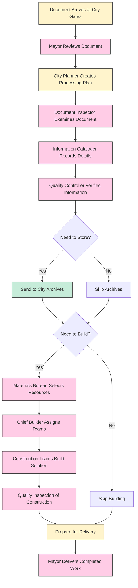
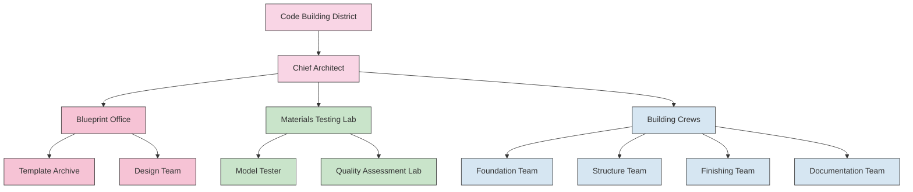

# Document Unification System - Metaphor Map

This document uses the Feynman method to explain the Document Unification System through intuitive metaphors, making complex components easier to understand and remember.

## System as a Document Processing City

Imagine the Document Unification System as a bustling city dedicated to processing documents. Each neighborhood has specialized functions, working together to turn raw documents into useful information and code.

```mermaid
graph TD
    classDef cityblock fill:#f9d5e5,stroke:#333,stroke-width:1px
    classDef factory fill:#d6e6f2,stroke:#333,stroke-width:1px
    classDef market fill:#c9e4ca,stroke:#333,stroke-width:1px
    classDef transport fill:#f6c3d5,stroke:#333,stroke-width:1px
    classDef storage fill:#f9cb9c,stroke:#333,stroke-width:1px
    classDef security fill:#e6b8af,stroke:#333,stroke-width:1px

    City[Document Unification City]
    City --> Agents[Agent District]
    City --> Utils[Utilities Quarter]
    City --> Storage[Storage District]
    City --> Auth[Security Checkpoint]
    City --> Examples[Training Grounds]
    City --> Tests[Quality Control Zone]
    
    Agents --> BaseAgent[Base Agent Academy]
    Agents --> EnhancedAgent[Enhanced Agent Academy]
    Agents --> SpecializedAgents[Specialized Agent Offices]
    Agents --> Orchestrators[Orchestration Tower]
    
    Utils --> StateUtils[State Management Office]
    Utils --> MessagingUtils[Post Office]
    Utils --> LLMUtils[Model Selection Bureau]
    Utils --> AdapterUtils[Integration Hub]
    
    Storage --> StorageInterface[Storage Planning Office]
    Storage --> ProviderImpl[Storage Warehouses]
    
    Auth --> JWT[ID Card Office]
    Auth --> Permissions[Permission Bureau]
    Auth --> Audit[Audit Department]
    
    Examples --> ExampleWorkflows[Example Showroom]
    Tests --> TestSuites[Quality Test Labs]
    
    class City cityblock
    class Agents cityblock
    class Utils cityblock
    class Storage storage
    class Auth security
    class Examples market
    class Tests factory
    
    class BaseAgent cityblock
    class EnhancedAgent cityblock
    class SpecializedAgents cityblock
    class Orchestrators transport
    
    class StateUtils factory
    class MessagingUtils transport
    class LLMUtils factory
    class AdapterUtils market
    
    class StorageInterface storage
    class ProviderImpl storage
    
    class JWT security
    class Permissions security
    class Audit security
    
    class ExampleWorkflows market
    class TestSuites factory
```

## Key Residents and Their Roles

### Document Processing Team

| City Metaphor | System Component | Role | Remembered As |
|---------------|------------------|------|---------------|
| Mayor | OrchestratorAgent | Overall coordination | The mayor who manages the entire city |
| City Planner | WorkflowOrchestrator | Plans and organizes work | The planner with maps and schedules |
| Document Inspector | ParserAgent | Examines documents | The inspector with a magnifying glass |
| Information Cataloger | MetadataAgent | Extracts and organizes information | The librarian with index cards |
| Quality Controller | ValidatorAgent | Verifies information quality | The quality inspector with a checklist |
| Chief Builder | CodeBuildingOrchestrator | Manages construction projects | The construction manager with blueprints |

### City Infrastructure

| City Metaphor | System Component | Role | Remembered As |
|---------------|------------------|------|---------------|
| City Hall Records | BaseProcessState | Stores process information | The records office with filing cabinets |
| Post Office | OrchestrationMessage | Communication system | Mail carriers delivering messages between offices |
| Materials Bureau | ModelSelectionFramework | Selects appropriate building materials | Material expert matching tasks to materials |
| City Archives | StorageInterface | Long-term information storage | Archive building with organized shelves |
| Security Checkpoint | AuthenticationSystem | Verifies identity and permissions | Guard checking IDs at city entrance |

## How Documents Flow Through the City

## The Code Building District

The Code Building District is where digital structures are built, using blueprints and specialized teams.

## The Message Delivery System

The city's post office (messaging system) ensures communication between all residents.

```mermaid
graph TD
    classDef postoffice fill:#f9d5e5,stroke:#333,stroke-width:1px
    classDef mail fill:#d6e6f2,stroke:#333,stroke-width:1px
    classDef carrier fill:#c9e4ca,stroke:#333,stroke-width:1px
    classDef sorter fill:#f6c3d5,stroke:#333,stroke-width:1px
    
    PostOffice[City Post Office] --> MailRoom[Mail Creation Room]
    PostOffice --> SortingDept[Message Sorting Department]
    PostOffice --> DeliveryTeam[Message Delivery Team]
    PostOffice --> ReceivingDept[Message Receiving Department]
    
    MailRoom --> MessageTemplates[Message Templates]
    MailRoom --> MessageWriters[Message Writers]
    
    SortingDept --> AddressBook[Address Directory]
    SortingDept --> RoutePlanner[Route Planner]
    
    DeliveryTeam --> RegularCarriers[Regular Carriers]
    DeliveryTeam --> ExpressCarriers[Express Carriers]
    DeliveryTeam --> SpecialtyCarriers[Specialty Carriers]
    
    ReceivingDept --> Inbox[Agent Inboxes]
    ReceivingDept --> ProcessingDesk[Message Processing Desk]
    
    class PostOffice postoffice
    class MailRoom mail
    class SortingDept sorter
    class DeliveryTeam carrier
    class ReceivingDept mail
    
    class MessageTemplates mail
    class MessageWriters mail
    
    class AddressBook sorter
    class RoutePlanner sorter
    
    class RegularCarriers carrier
    class ExpressCarriers carrier
    class SpecialtyCarriers carrier
    
    class Inbox mail
    class ProcessingDesk mail
```

## Memory Locations (Method of Loci)

To remember the system using the method of loci, visualize walking through this city:

1. **City Gates** (Entry Point)
   - The main entrance where documents arrive
   - Security checkpoints verify credentials
   - Information boards display workflows

2. **Central Plaza** (Orchestration Tower)
   - Tall central building where the Mayor (OrchestratorAgent) works
   - City planning office for organizing workflows
   - Main message board for status updates

3. **Eastern District** (Document Processing)
   - Document Inspection Office
   - Information Cataloging Department
   - Quality Control Building

4. **Western District** (Code Building)
   - Architect offices with blueprint tables
   - Construction zones with specialized teams
   - Materials testing lab for model selection

5. **Northern District** (Utilities)
   - Post Office for message delivery
   - Records Office for state management
   - Integration Hub for external connections

6. **Southern District** (Storage)
   - Archive buildings with organized shelves
   - Retrieval services for accessing stored information
   - Backup warehouse for document safety

As you mentally walk through this city, each location reminds you of a specific component and its function within the system.

## Mapping Real Code to City Metaphors

| Real Code File/Component | City Metaphor | Location in City |
|--------------------------|---------------|------------------|
| src/agents/orchestrator.py | The Mayor | Central Plaza, Mayor's Office |
| src/agents/workflow_orchestrator.py | City Planner | Central Plaza, Planning Department |
| src/agents/parser_agent.py | Document Inspector | Eastern District, Inspection Office |
| src/agents/metadata_agent.py | Information Cataloger | Eastern District, Cataloging Department |
| src/agents/validator_agent.py | Quality Controller | Eastern District, Quality Control Building |
| src/agents/code_building_workflow.py | Chief Builder | Western District, Construction Office |
| src/utils/orchestrator_state.py | City Records | Northern District, Records Office |
| src/utils/orchestrator_messaging.py | Post Office | Northern District, Post Office |
| src/utils/llm_provider/model_selection_framework.py | Materials Bureau | Western District, Materials Testing Lab |
| src/storage/storage_interface.py | City Archives | Southern District, Archive Building |
| src/auth/ | Security Checkpoint | City Gates, Security Office |

## Learning the System Through the City Tour

To learn the Document Unification System:

1. **Start at the City Gates** - Understand the entry points and authentication
2. **Visit the Mayor's Office** - Learn about the orchestration process
3. **Tour the Eastern District** - See how documents are processed
4. **Explore the Western District** - Understand code building
5. **Walk through the Northern District** - Learn about utilities and messaging
6. **End at the Southern District** - Understand storage and retrieval

This mental journey through the city creates spatial memory anchors that make the complex system easier to recall and understand.