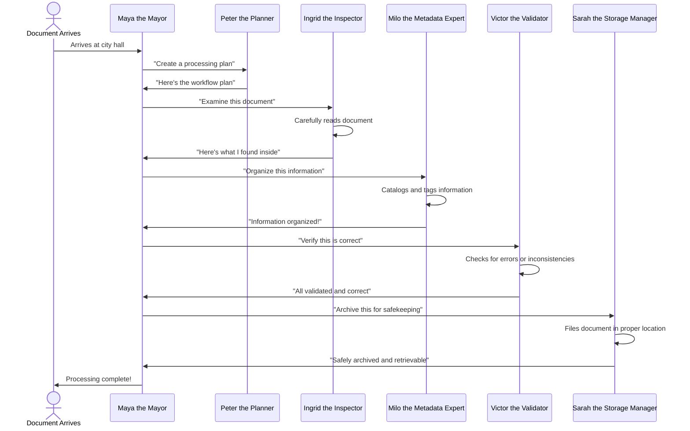
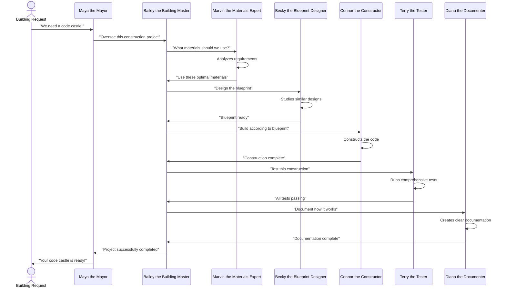
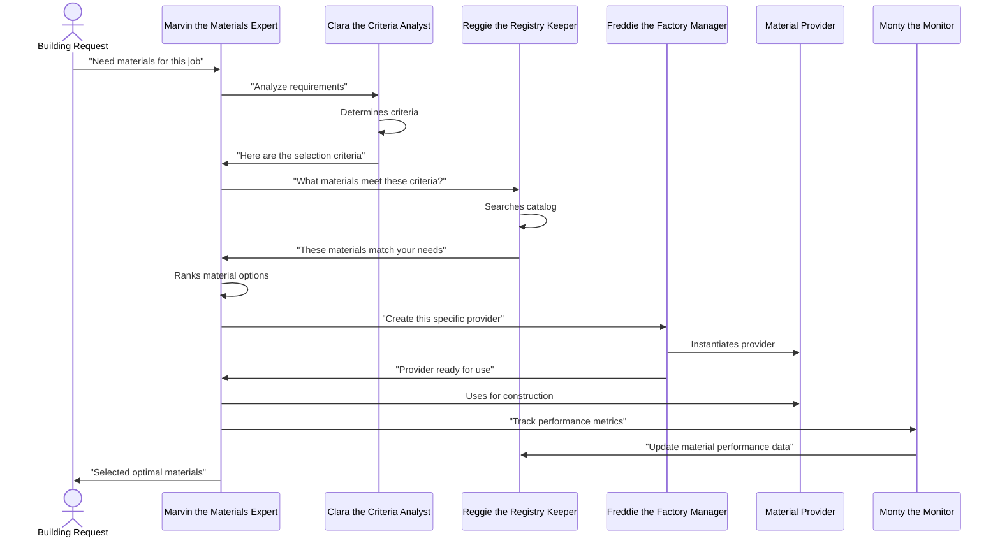
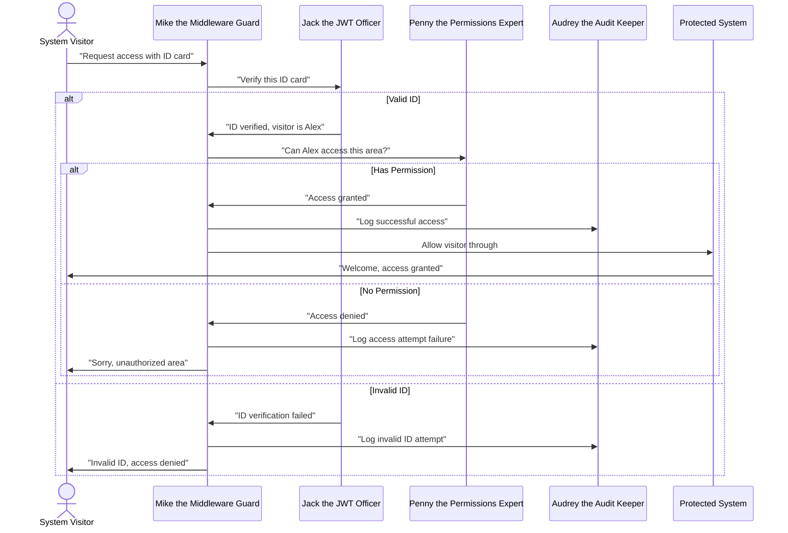

# Document Unification System - Workflow Storyboards

This document uses the Feynman method to explain the main workflows of the Document Unification System through simple storyboard narratives. Each workflow is presented as a story with characters representing system components.

## Document Processing Workflow

### Characters

- **Maya the Mayor** (OrchestratorAgent) - Oversees the entire city operation
- **Peter the Planner** (WorkflowOrchestrator) - Creates and tracks process plans
- **Ingrid the Inspector** (ParserAgent) - Examines and interprets documents
- **Milo the Metadata Expert** (MetadataAgent) - Extracts and organizes information
- **Victor the Validator** (ValidatorAgent) - Ensures information accuracy
- **Sarah the Storage Manager** (StorageOrchestrator) - Archives completed work

### Storyboard: "The Document's Journey"

### The Story

It's a sunny morning in Document City when a new document arrives at City Hall. Maya the Mayor, who oversees all city operations, receives it with a smile.

"We have a new document to process," Maya announces, handing it to Peter the Planner. "Can you create a processing plan for this?"

Peter examines the document, notes its type and urgency, and quickly drafts a workflow plan. "This looks like a technical specification," he says. "Here's the processing sequence we should follow."

With plan in hand, Maya first calls Ingrid the Inspector. "Please examine this document thoroughly," Maya requests.

Ingrid puts on her special document glasses and carefully reads through every page. "Interesting!" she remarks. "This contains technical diagrams, code snippets, and implementation requirements. Here's my structured breakdown of what I found."

Next, Maya visits Milo the Metadata Expert. "Organize all this information properly," she instructs, handing over Ingrid's findings.

Milo works meticulously, creating categories, tags, and relationships. "Everything's organized by topic, importance, and relationship," he reports. "You can easily find any piece of information now."

For quality assurance, Maya then consults Victor the Validator. "Please verify everything is correct and consistent," she asks.

Victor compares the organized information against the original document, checking for errors, inconsistencies, or missing details. "All validated," he confirms. "The information is complete and accurate."

Finally, Maya takes the fully processed document to Sarah the Storage Manager. "This needs to be archived for safekeeping and future retrieval," Maya explains.

Sarah carefully files the document and its organized information in the appropriate secure location. "Successfully archived," she reports. "It can be retrieved whenever needed."

With all tasks complete, Maya marks the document as fully processed. The journey from raw document to organized, validated, and stored information is complete, ready to provide value to the city's residents.

*Memory hook: This story helps you remember the document processing workflow sequence: Orchestration → Planning → Parsing → Metadata extraction → Validation → Storage.*

## Code Building Workflow

### Characters

- **Maya the Mayor** (OrchestratorAgent) - Oversees the entire city operation
- **Bailey the Building Master** (CodeBuildingOrchestrator) - Manages construction projects
- **Marvin the Materials Expert** (ModelSelectionAgent) - Selects optimal building materials
- **Becky the Blueprint Designer** (CodeRetrievalAgent) - Creates initial design blueprints
- **Connor the Constructor** (CodeSynthesisAgent) - Builds the actual code structures
- **Terry the Tester** (TestingAgent) - Ensures everything works properly
- **Diana the Documenter** (DocumentationAgent) - Creates explanatory documentation

### Storyboard: "Building Code Castle"

### The Story

The city receives an exciting request: "We need a code castle that can process data securely!" Maya the Mayor immediately recognizes this as a construction project and calls Bailey the Building Master.

"We have a new construction project," Maya explains. "Please oversee building this code castle for processing data."

Bailey first consults with Marvin the Materials Expert. "Given these requirements, what building materials would work best?" Bailey asks.

Marvin carefully analyzes the project needs - performance, reliability, security. "For this project," Marvin advises, "we should use the GPT-4 framework for the core logic, with Python for the implementation. These materials will give us the best balance of functionality and maintainability."

With materials selected, Bailey approaches Becky the Blueprint Designer. "We need a blueprint for this data processing castle," Bailey requests.

Becky researches similar structures and designs a comprehensive blueprint. "Here's the design," she presents. "It includes data input chambers, processing hallways, security checkpoints, and output towers."

Now it's time to build. Bailey hands the blueprint to Connor the Constructor. "Build this according to the specifications," Bailey instructs.

Connor works diligently, constructing functions, classes, and modules according to the blueprint. "Construction complete," Connor reports. "The castle has all the required components connected properly."

Next comes quality assurance. Bailey calls Terry the Tester. "Please verify this castle works as expected," Bailey requests.

Terry conducts thorough testing - unit tests, integration tests, security tests. "All tests passing," Terry confirms. "The castle processes data correctly, maintains security, and handles errors gracefully."

Finally, Bailey asks Diana the Documenter to create explanatory materials. "We need clear documentation for this castle," Bailey explains.

Diana creates user guides, API documentation, and example workflows. "Documentation complete," Diana reports. "Users will understand how to use every aspect of the castle."

With all stages complete, Bailey reports back to Maya. "The code castle project has been successfully completed," Bailey announces proudly.

Maya inspects the final result and delivers it to the requester. "Your code castle is ready!" Maya declares. "It's built with quality materials, follows best practices, passes all tests, and comes with comprehensive documentation."

*Memory hook: This story helps you remember the code building workflow sequence: Orchestration → Material selection → Blueprint design → Construction → Testing → Documentation.*

## Model Selection Workflow

### Characters

- **Marvin the Materials Expert** (ModelSelectionAgent) - Selects optimal materials/models
- **Reggie the Registry Keeper** (ModelRegistry) - Maintains catalog of available materials
- **Clara the Criteria Analyst** (SelectionCriteria) - Determines selection requirements
- **Monty the Monitor** (MetricsCollector) - Tracks performance metrics
- **Freddie the Factory Manager** (ProviderFactory) - Creates provider instances

### Storyboard: "Choosing the Perfect Materials"

### The Story

When a new building request arrives in Document City, it's Marvin the Materials Expert's job to select the perfect building materials. This process is crucial - choose wrong, and the entire structure might collapse!

"We need materials for a data transformation tower," says the client. "It needs to be precise and handle complex logical operations."

Marvin first consults with Clara the Criteria Analyst. "Let's determine exactly what we need," Marvin suggests.

Clara analyzes the requirements meticulously. "This project requires high reasoning ability, code generation capability, contextual understanding, and must work with Python," she concludes. "Performance is more important than cost for this project."

With clear criteria in hand, Marvin visits Reggie the Registry Keeper, who maintains a vast catalog of all available building materials. "I need materials matching these specific criteria," Marvin explains.

Reggie searches through the extensive materials catalog. "Based on your criteria, I've found three options," Reggie reports. "GPT-4 has the highest reasoning and contextual understanding, Claude has excellent code generation for Python, and LLaMA Code has good balance at lower cost."

Marvin evaluates each option, balancing capabilities against the specific requirements. "For this project, GPT-4 will give us the best results," Marvin decides.

Next, Marvin visits Freddie the Factory Manager. "I need a GPT-4 provider for this project," Marvin requests.

Freddie configures the factory line and produces a ready-to-use GPT-4 provider. "Your provider is ready to go," Freddie announces. "It's configured with the optimal settings for your specific needs."

As construction begins using the selected material, Marvin asks Monty the Monitor to track performance. "Please measure how well this material performs on our key metrics," Marvin requests.

Monty diligently records response quality, processing time, and resource usage. "I'll make sure we have accurate performance data," Monty assures.

After the project completes, Monty visits Reggie. "Here's the performance data from our latest GPT-4 usage," Monty reports. "It performed exceptionally well on reasoning tasks but used more tokens than estimated."

Reggie updates the catalog with this new information. "This will help future material selection be even more accurate," Reggie notes.

Marvin reports back to the client: "We've selected GPT-4 for your project, as it provides the precision and logical capabilities your data transformation tower requires. Construction can now proceed with optimal materials."

*Memory hook: This story helps you remember the model selection workflow sequence: Determine criteria → Search registry → Select model → Create provider → Track metrics → Update registry.*

## Authentication Workflow

### Characters

- **Sam the Security Chief** (AuthenticationSystem) - Manages overall security
- **Jack the JWT Officer** (JWTManager) - Creates and verifies security tokens
- **Penny the Permissions Expert** (PermissionsSystem) - Controls access rights
- **Audrey the Audit Keeper** (AuditLogger) - Records all security events
- **Mike the Middleware Guard** (SecurityMiddleware) - Checks all incoming requests

### Storyboard: "Securing the City Gates"

### The Story

The security of Document City is of utmost importance, and the main entrance is protected by a sophisticated security system. Sam the Security Chief has designed a multi-layered approach to keep the city safe.

When a visitor approaches the city gates, they're first greeted by Mike the Middleware Guard. "Welcome to Document City," Mike says. "I'll need to see your ID card before you can enter."

The visitor presents what appears to be an official Document City JWT ID card. Mike doesn't make any decisions himself - instead, he passes the ID card to Jack the JWT Officer.

"Please verify if this ID is authentic and current," Mike requests.

Jack examines the ID thoroughly, checking the digital signature, expiration date, and security features. If the ID is valid, Jack reports back: "This is a valid ID card belonging to Alex, issued by our authority and not yet expired."

If the ID verification fails, Jack immediately alerts Mike: "This ID is invalid - the signature doesn't match our records," or "This ID has expired," or "This ID has been tampered with."

When the ID is invalid, Mike consults Audrey the Audit Keeper. "Please record this invalid ID attempt," Mike requests. Audrey makes a careful note of the incident, recording the time, the presented ID, and the reason for rejection.

Mike then informs the visitor: "I'm sorry, but your ID is invalid. Access denied."

However, when the ID is valid, Mike needs to check if the visitor has permission for the requested area. He consults Penny the Permissions Expert.

"Alex wants to access the Document Processing Department. Do they have permission?" Mike asks.

Penny checks Alex's role and the access rules for the requested area. If authorized, Penny responds: "Alex has the 'Document Processor' role, which grants access to that department. Request approved."

If unauthorized, Penny responds: "Alex does not have the required role for that department. Request denied."

For either outcome, Mike asks Audrey to log the attempt. "Please record this access attempt," Mike requests. Audrey diligently notes the details - who attempted access, to which area, whether it was granted or denied, and when it occurred.

If access is granted, Mike welcomes the visitor: "Welcome, Alex. You're cleared to enter the Document Processing Department." The visitor can now proceed into the city.

If access is denied, Mike politely but firmly informs the visitor: "I'm sorry, Alex, but you don't have permission to enter the Document Processing Department."

Throughout the day, Sam the Security Chief reviews Audrey's logs to monitor security patterns and address any concerns.

*Memory hook: This story helps you remember the authentication workflow sequence: Request interception → Token validation → Permission checking → Audit logging → Access decision.*

## Memory Link to Code Files

Each character in these stories represents a specific component in the Document Unification System's code:

| Story Character | System Component | Code File Path |
|-----------------|------------------|----------------|
| Maya the Mayor | OrchestratorAgent | src/agents/orchestrator.py |
| Peter the Planner | WorkflowOrchestrator | src/agents/workflow_orchestrator.py |
| Ingrid the Inspector | ParserAgent | src/agents/parser_agent.py |
| Milo the Metadata Expert | MetadataAgent | src/agents/metadata_agent.py |
| Victor the Validator | ValidatorAgent | src/agents/validator_agent.py |
| Bailey the Building Master | CodeBuildingOrchestrator | src/agents/code_building_workflow.py |
| Marvin the Materials Expert | ModelSelectionAgent | src/agents/code_building/model_selection_agent.py |
| Reggie the Registry Keeper | ModelRegistry | src/utils/llm_provider/model_selection_framework.py |
| Sam the Security Chief | AuthenticationSystem | src/auth/ |
| Jack the JWT Officer | JWTManager | src/auth/jwt_manager.py |
| Penny the Permissions Expert | PermissionsSystem | src/auth/permissions.py |
| Audrey the Audit Keeper | AuditLogger | src/auth/audit.py |
| Mike the Middleware Guard | SecurityMiddleware | src/auth/middleware.py |

By visualizing these characters and their interactions, you create memorable mental hooks for understanding how the system components work together in different workflows.