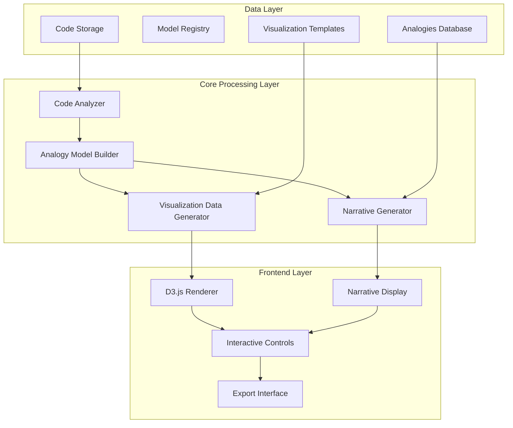

# Super Simple Code Framework Visualizer - Implementation Guide

This implementation guide provides detailed steps for building the Super Simple Code Framework Visualizer based on the process model and analysis. It translates the abstract process flow into concrete development tasks.

## System Architecture Overview



## Component Implementation Details

### 1. Code Scanner Tool

**Technology Stack:**
- Python with AST (Abstract Syntax Tree) module
- Directory walker utilities
- Basic code metrics libraries

**Core Functions:**
```python
def scan_folder(folder_path: str) -> dict:
    """Scan a folder and identify code components."""
    result = {
        "houses": [],  # folders/modules
        "people": [],  # classes/components
        "toys": [],    # functions/methods
        "notes": [],   # configuration files
        "plugs": [],   # APIs/external connections
        "connections": []  # relationships
    }
    
    # Implementation logic
    
    return result

def identify_component_type(file_path: str, content: str) -> str:
    """Determine if a file contains houses, people, toys, etc."""
    # Implementation logic
    
    return component_type

def extract_relationships(components: dict) -> list:
    """Extract relationships between identified components."""
    # Implementation logic
    
    return relationships
```

**Key Interfaces:**
- Input: Folder path or file list
- Output: JSON structure with classified components and relationships

### 2. Building Blocks System

**Technology Stack:**
- Python or JavaScript for data transformation
- Graph data structure library
- Configuration system for analogy mapping rules

**Core Functions:**
```python
def map_to_building_blocks(raw_components: dict) -> dict:
    """Map raw code components to ELI5 building blocks."""
    model = {
        "nodes": [],
        "edges": [],
        "metadata": {}
    }
    
    # Implementation logic
    
    return model

def apply_house_rules(folders: list) -> list:
    """Apply rules to transform folders into houses."""
    # Implementation logic
    
    return houses

def apply_people_rules(classes: list) -> list:
    """Apply rules to transform classes into people."""
    # Implementation logic
    
    return people

def build_action_map(components: dict, relationships: list) -> dict:
    """Create the action map showing relationships."""
    # Implementation logic
    
    return action_map
```

**Key Interfaces:**
- Input: Raw component dictionary from Code Scanner
- Output: Structured model with analogies and action map

### 3. Picture Maker (Visual Data Generator)

**Technology Stack:**
- JavaScript with D3.js
- SVG manipulation libraries
- Color theory library for visual attributes

**Core Functions:**
```javascript
function generateVisualData(structuredModel) {
    const visualData = {
        nodes: [],
        links: [],
        groups: [],
        attributes: {}
    };
    
    // Implementation logic
    
    return visualData;
}

function assignVisualAttributes(node) {
    // Assign colors, shapes, sizes based on node type
    // Implementation logic
    
    return enhancedNode;
}

function computeLayoutPositions(nodes, links) {
    // Determine initial layout positions
    // Implementation logic
    
    return positionedNodes;
}

function generateEmojisForComponents(nodes) {
    // Assign appropriate emojis
    // Implementation logic
    
    return nodesWithEmojis;
}
```

**Key Interfaces:**
- Input: Structured model with analogies and action map
- Output: D3.js-compatible visualization data with visual attributes

### 4. Story Builder (Narrative Generator)

**Technology Stack:**
- Template engine (Handlebars, Nunjucks, or similar)
- Natural language processing library for sentence construction
- Analogy database

**Core Functions:**
```javascript
function generateNarrative(structuredModel) {
    const narrative = {
        introduction: '',
        componentDescriptions: [],
        flowDescription: '',
        analogies: []
    };
    
    // Implementation logic
    
    return narrative;
}

function createComponentDescription(component) {
    // Create ELI5 description for a component
    // Implementation logic
    
    return description;
}

function createFlowNarrative(actionMap) {
    // Generate numbered steps explaining the flow
    // Implementation logic
    
    return numberedSteps;
}

function applyRealWorldAnalogies(components, relationships) {
    // Find and apply real-world analogies
    // Implementation logic
    
    return analogies;
}
```

**Key Interfaces:**
- Input: Structured model with analogies and action map
- Output: Narrative content structured for display and integration

### 5. D3.js Renderer

**Technology Stack:**
- D3.js
- SVG
- HTML5 Canvas (optional for performance with large graphs)

**Core Functions:**
```javascript
function renderVisualization(visualData, containerId) {
    // Set up SVG container
    const svg = d3.select('#' + containerId)
        .append('svg')
        .attr('width', width)
        .attr('height', height);
    
    // Render nodes, links, labels
    // Implementation logic
    
    return svgElement;
}

function renderHouses(svg, houses) {
    // Render house-type components
    // Implementation logic
}

function renderPeople(svg, people) {
    // Render people-type components
    // Implementation logic
}

function renderConnections(svg, connections) {
    // Render relationship lines
    // Implementation logic
}
```

**Key Interfaces:**
- Input: Visualization data from Picture Maker
- Output: Rendered SVG/HTML visualization

### 6. Interactive Layer

**Technology Stack:**
- JavaScript
- D3.js events
- Web animations API

**Core Functions:**
```javascript
function initializeInteractivity(svg, narrative, options) {
    // Set up event handlers
    // Implementation logic
    
    return controlHandlers;
}

function setupComponentHighlighting(svg) {
    // Add click-to-highlight functionality
    // Implementation logic
}

function setupDragAndDrop(svg) {
    // Add drag functionality
    // Implementation logic
}

function setupZoomControls(svg, container) {
    // Add zoom in/out capabilities
    // Implementation logic
}

function setupAnimationPlayback(svg, narrative, flowSteps) {
    // Add functionality to "play" the code flow
    // Implementation logic
}
```

**Key Interfaces:**
- Input: Rendered visualization and narrative content
- Output: Interactive web application with event handlers

### 7. Export System

**Technology Stack:**
- HTML/CSS bundling
- SVG export library
- PDF generation (optional)

**Core Functions:**
```javascript
function exportVisualization(format, visualization, narrative) {
    // Handle export in requested format
    // Implementation logic
    
    return exportedContent;
}

function createHTMLStorybook(visualization, narrative) {
    // Bundle visualization and narrative into HTML
    // Implementation logic
    
    return htmlContent;
}

function createImageExport(svg) {
    // Export SVG as PNG/JPEG
    // Implementation logic
    
    return imageData;
}

function createPDFExport(visualization, narrative) {
    // Generate PDF document
    // Implementation logic
    
    return pdfDocument;
}
```

**Key Interfaces:**
- Input: Complete interactive visualization and narrative
- Output: Shareable content in selected format

## Implementation Roadmap

### Sprint 1: Foundation
1. Set up project structure and repositories
2. Implement basic Code Scanner Tool
3. Create simple Building Blocks classification system
4. Develop initial data structures for code representation

### Sprint 2: Core Processing
1. Complete Building Blocks System implementation
2. Implement basic Picture Maker functionality
3. Develop initial Story Builder templates
4. Create data transformations between components

### Sprint 3: Visualization
1. Implement D3.js rendering
2. Create basic visual styles for components
3. Develop initial layout algorithms
4. Integrate visualizations with narrative content

### Sprint 4: Interactivity
1. Implement component highlighting
2. Add zoom and pan functionality
3. Develop drag-and-drop capabilities
4. Create animated walkthrough of code flow

### Sprint 5: Complete System
1. Implement export functionality
2. Add theme customizations
3. Integrate all components into cohesive system
4. Create user documentation and examples

## Technology Stack Summary

| Component | Primary Technologies | Alternative Options |
|-----------|---------------------|---------------------|
| Code Scanner | Python, AST | JavaScript with Babel parser, Antlr |
| Building Blocks System | Python/JavaScript, Graph libraries | TypeScript, JSON transformation libraries |
| Picture Maker | JavaScript, D3.js | Cytoscape.js, GoJS, React Flow |
| Story Builder | Template engine, NLP libraries | GPT-based text generation, Handlebars |
| Renderer | D3.js, SVG | Three.js (for 3D visualization), HTML Canvas |
| Interactive Layer | JavaScript, D3.js events | React, Vue.js, Web Components |
| Export System | HTML/CSS bundling, SVG export | PDF generation libraries, Image manipulation |

## System Requirements

### Development Environment
- Node.js 14+ or Python 3.8+
- Modern web browser with SVG support
- Code editor with JavaScript/Python support
- D3.js and relevant libraries
- Build tools (webpack, rollup, or similar)

### Production Environment
- Static web server or CDN
- Modern web browsers (Chrome, Firefox, Safari, Edge)
- Minimum 4GB RAM for processing large codebases
- Optional: Server component for handling large projects

## Testing Strategy

1. **Unit Testing**
   - Test individual components (scanners, transformers, generators)
   - Use sample code fragments as test fixtures

2. **Integration Testing**
   - Test interactions between components
   - Verify data transformations maintain integrity

3. **Visual Testing**
   - Verify rendered output matches expected visualization
   - Test across browsers and screen sizes

4. **User Testing**
   - Test with target audience for comprehension
   - Collect feedback on clarity and usefulness

## Performance Considerations

1. **Large Codebase Handling**
   - Implement progressive loading for large projects
   - Consider server-side processing for initial analysis
   - Use WebWorkers for client-side processing

2. **Rendering Optimization**
   - Implement virtual rendering for large visualizations
   - Consider Canvas rendering for very large graphs
   - Optimize SVG generation and manipulation

3. **Memory Management**
   - Implement proper cleanup for disposed visualizations
   - Monitor memory usage during complex operations
   - Consider chunked processing for large datasets

## Conclusion

This implementation guide provides a blueprint for building the Super Simple Code Framework Visualizer system based on the process analysis. By following this structured approach, developers can create an effective "ELI5" code visualization tool that transforms complex code into accessible, interactive narratives.

The component-based architecture allows for incremental development and testing, with clear interfaces between system parts. The suggested technologies balance power and accessibility, making the system adaptable to different environments and use cases.

The next step is to begin implementation following the sprint roadmap, starting with the foundational components and progressively building toward the complete interactive system.