# Super Simple Code Framework Visualizer - Scalability Model

This document presents a comprehensive scalability model for the Super Simple Code Framework Visualizer, examining how the system can effectively handle increasing complexity, load, and diverse usage scenarios while maintaining performance and user experience quality.

## Scalability Dimensions

The visualization system must scale across multiple dimensions simultaneously:

```mermaid
graph TD
    ScalabilityModel[Visualization System Scalability Model] --> CodeScale[Code Scale]
    ScalabilityModel --> UserScale[User Scale]
    ScalabilityModel --> FunctionalScale[Functional Scale]
    ScalabilityModel --> OrganizationalScale[Organizational Scale]
    ScalabilityModel --> DeploymentScale[Deployment Scale]
    
    CodeScale --> CodeSize[Codebase Size]
    CodeScale --> CodeComplexity[Code Complexity]
    CodeScale --> CodeLanguages[Language Diversity]
    
    UserScale --> ConcurrentUsers[Concurrent Users]
    UserScale --> UserTypes[User Types]
    UserScale --> UsagePatterns[Usage Patterns]
    
    FunctionalScale --> VisualizationTypes[Visualization Types]
    FunctionalScale --> InteractionModes[Interaction Modes]
    FunctionalScale --> IntegrationPoints[Integration Points]
    
    OrganizationalScale --> TeamSize[Team Size]
    OrganizationalScale --> GeographicDistribution[Geographic Distribution]
    OrganizationalScale --> CrossFunctionalUse[Cross-Functional Use]
    
    DeploymentScale --> InfrastructureModels[Infrastructure Models]
    DeploymentScale --> SecurityRequirements[Security Requirements]
    DeploymentScale --> AvailabilityNeeds[Availability Needs]
```

## Code Scale Scalability

The system must effectively handle growing codebases of varying complexity and language diversity.

### Codebase Size Scaling

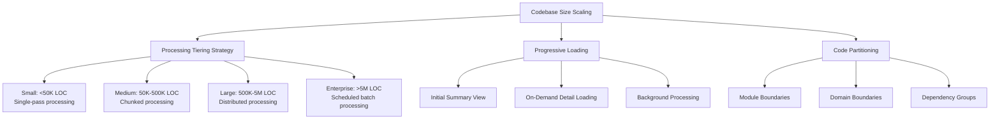

**Scaling Mechanisms:**

1. **Hierarchical Processing**
   - Initial high-level scan for structure (O(n) complexity)
   - Detail processing only for viewed components (amortized O(log n))
   - Background processing for full detail when resources available

2. **Visualization Level-of-Detail**
   - Automatic simplification for large codebases
   - Dynamic visualization complexity based on view context
   - On-demand rendering of detailed components

3. **Memory Management**
   - Stream processing for initial scanning
   - Virtual list rendering for component displays
   - Cached partial models with LRU eviction policy

**Scaling Metrics & Thresholds:**

| Codebase Size | Processing Approach | Processing Time Target | Memory Footprint Target |
|---------------|---------------------|------------------------|-------------------------|
| < 50K LOC     | Single-pass         | < 10 seconds           | < 500 MB               |
| 50K-500K LOC  | Chunked             | < 60 seconds           | < 1 GB                 |
| 500K-5M LOC   | Distributed         | < 5 minutes            | < 2 GB per node        |
| > 5M LOC      | Scheduled batch     | < 30 minutes           | Distributed            |

### Code Complexity Scaling

As code complexity grows, the visualization must adapt to maintain clarity while representing intricate relationships.

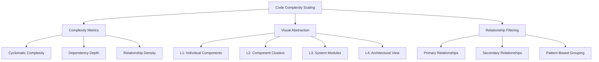

**Scaling Mechanisms:**

1. **Adaptive Detail Level**
   - Automatic complexity detection and visualization adjustment
   - Simplified view for high-complexity areas with drill-down capability
   - Pattern recognition to represent common structures with simplified visuals

2. **Smart Relationship Visualization**
   - Bundle similar relationships to reduce visual clutter
   - Focus + context techniques to emphasize relevant relationships
   - Temporal separation of relationship display (show/hide on demand)

3. **Interaction-Based Simplification**
   - Start with simplest representation
   - Progressive disclosure of complexity through user interaction
   - Context-sensitive detail expansion

**Complexity Thresholds and Adaptations:**

| Complexity Level | Visual Adaptation | Narrative Adaptation | Interaction Model |
|------------------|-------------------|----------------------|-------------------|
| Low              | Direct representation | Straightforward explanation | Static viewing suitable |
| Medium           | Grouped components | Hierarchical explanation | Basic interaction needed |
| High             | Pattern abstraction | Conceptual explanation first | Guided exploration needed |
| Very High        | Multi-level abstraction | Analogy-first approach | Interactive exploration essential |

## User Scale Scalability

The system must efficiently serve multiple concurrent users with varied needs and usage patterns.

### Concurrent User Scaling

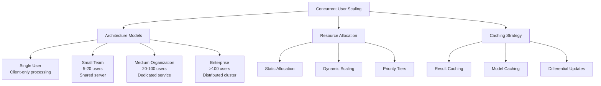

**Scaling Mechanisms:**

1. **Multi-Tiered Processing Architecture**
   - Offload visualization rendering to client devices
   - Centralize complex code analysis on servers
   - Hybrid approaches based on client capabilities

2. **Resource Optimization**
   - Prioritize interactive sessions over background processing
   - Share processing results across similar requests
   - Time-slice processing for non-interactive operations

3. **Progressive Enhancement**
   - Core functionality with minimal resources
   - Enhanced features with additional resources
   - Graceful degradation under load

**User Scale Deployment Models:**

| Scale | Users | Architecture | Infrastructure | Caching Strategy |
|-------|-------|--------------|----------------|------------------|
| Individual | 1-5 | Client-heavy | Single server/serverless | Session-based |
| Team | 5-20 | Balanced | Dedicated server | Shared, short TTL |
| Department | 20-100 | Server-focused | Multiple servers | Hierarchical, medium TTL |
| Enterprise | 100+ | Distributed | Server cluster | Distributed, content-based |

### Usage Pattern Adaptability

The system must adapt to different usage patterns while efficiently utilizing resources.

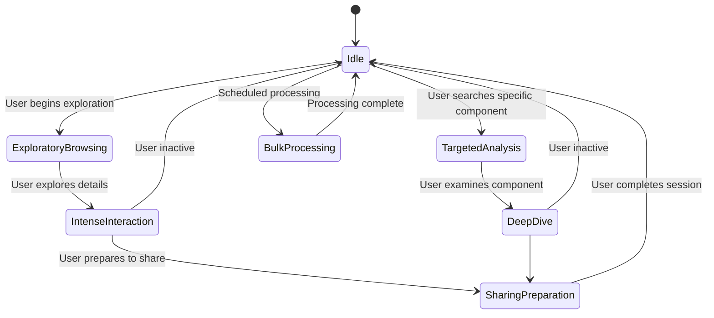

**Scaling Mechanisms:**

1. **Workload Detection and Adaptation**
   - Identify usage patterns automatically
   - Allocate resources based on pattern type
   - Precompute likely next visualization needs

2. **Session Management**
   - Maintain interactive sessions with priority
   - Gracefully hibernate inactive sessions
   - Efficient session restoration

3. **Background Processing Optimization**
   - Schedule intensive processing during low usage periods
   - Parallelize processing across available resources
   - Cancel or deprioritize obsolete processing requests

**Usage Pattern Resource Allocation:**

| Usage Pattern | Characteristic | Resource Priority | Optimization Approach |
|---------------|----------------|-------------------|------------------------|
| Exploratory Browsing | Unpredictable navigation | Medium-High | Prefetch adjacent components |
| Targeted Analysis | Deep focus on specifics | High | Prioritize detail rendering |
| Bulk Documentation | Large output generation | Low-Medium | Background processing |
| Sharing/Export | Generating shareable artifacts | Medium | Dedicated rendering resources |
| Integration API | External system calls | Varies by SLA | Resource quotas and throttling |

## Functional Scale Scalability

The system must scale to support a growing set of functionality while maintaining performance and usability.

### Visualization Types Scaling

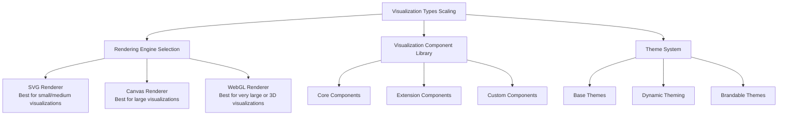

**Scaling Mechanisms:**

1. **Pluggable Visualization Engines**
   - SVG-based rendering for standard visualizations
   - Canvas rendering for high-component visualizations
   - WebGL for extremely large or 3D visualizations
   - Dynamic engine selection based on visualization needs

2. **Component-Based Architecture**
   - Core visualization components (base system)
   - Extension components (optional features)
   - Custom components (organization-specific)
   - Lazy-loading of components based on usage

3. **Configurable Pipelines**
   - Customizable visualization generation pipeline
   - Plugin architecture for processing steps
   - Feature flags for enabling/disabling capabilities

**Functional Extension Points:**

| Extension Point | Purpose | Scalability Approach | Resource Impact |
|-----------------|---------|----------------------|-----------------|
| Rendering Engines | Support different visualization outputs | Pluggable rendering engines | Medium |
| Analysis Plugins | Add custom code analysis capabilities | Pipeline injection points | High |
| Visualization Components | Add new visual representations | Component registry | Low-Medium |
| Narrative Generators | Customize explanatory content | Template and strategy patterns | Low |
| Export Formats | Support additional output formats | Output adapters | Low |

### Integration Points Scaling

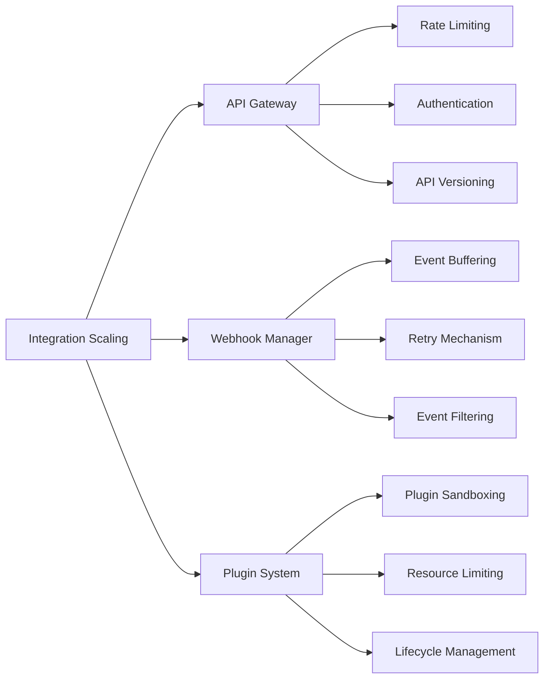

**Scaling Mechanisms:**

1. **API Management Layer**
   - Consistent entry point for all integrations
   - Rate limiting and throttling protection
   - Authentication and authorization enforcement
   - Version management and compatibility

2. **Event Processing Architecture**
   - Buffer incoming webhooks and events
   - Process events asynchronously
   - Scale event processors horizontally
   - Prioritize event processing by type

3. **Plugin Environment Management**
   - Isolate plugin execution
   - Limit resource consumption
   - Version compatibility management
   - Performance monitoring and problematic plugin detection

**Integration Scaling Strategies:**

| Integration Type | Scaling Challenge | Solution Approach | Protection Mechanisms |
|------------------|-------------------|-------------------|------------------------|
| Direct API Calls | Request spikes | Auto-scaling API servers | Rate limiting, request queuing |
| Webhooks | Event floods | Event buffering and processing | Backpressure, prioritization |
| Plugins/Extensions | Resource abuse | Sandboxed execution | Resource quotas, timeouts |
| Embedded Content | Render demand | Client-side rendering | Caching, simplified fallbacks |
| Data Exchange | Data volume | Compression, incremental updates | Size limits, pagination |

## Organizational Scale Scalability

The system must effectively support organizations of different sizes and structures.

### Multi-Team Support

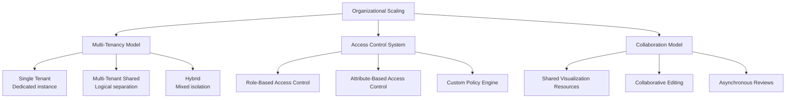

**Scaling Mechanisms:**

1. **Multi-Tenancy Architecture**
   - Configurable isolation between organizations
   - Shared resources with logical separation
   - Private deployment options for high security needs

2. **Advanced Access Control**
   - Fine-grained permissions for visualization resources
   - Role-based access aligned with organizational structure
   - Inheritance and delegation of permissions

3. **Collaboration Infrastructure**
   - Shared visualization workspaces
   - Real-time collaborative viewing
   - Asynchronous commenting and annotation
   - Cross-team visualization sharing

**Organizational Scale Models:**

| Scale | Users | Teams | Access Control | Resource Isolation | Collaboration Model |
|-------|-------|-------|----------------|-------------------|---------------------|
| Small | <20 | 1-2 | Simple roles | Single instance | Direct sharing |
| Medium | 20-100 | 3-10 | Team-based roles | Logical separation | Team workspaces |
| Large | 100-1000 | 10-50 | RBAC with hierarchy | Resource pooling | Cross-team sharing |
| Enterprise | 1000+ | 50+ | RBAC+ABAC with custom policies | Multiple instances with federation | Federated collaboration |

### Geographic Distribution

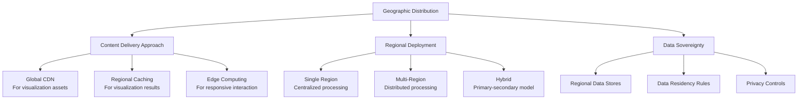

**Scaling Mechanisms:**

1. **Distributed Content Delivery**
   - CDN for static visualization assets
   - Regional rendering services for dynamic content
   - Edge computing for interactive elements

2. **Regional Processing Architecture**
   - Regional code processing services
   - Cross-region result sharing (where allowed)
   - Region-aware scheduling and load balancing

3. **Data Residency Management**
   - Configurable data storage locations
   - Region-specific data handling rules
   - Clear data movement tracking and controls

**Geographic Distribution Models:**

| Model | Architecture | Performance Characteristics | Data Handling |
|-------|--------------|----------------------------|---------------|
| Centralized | Single-region processing with global CDN | High latency for distant users | Single data location |
| Regional Replicas | Processing in multiple regions | Low latency for regional users | Replicated non-sensitive data |
| Federated | Independent instances with coordination | Region-optimal performance | Strict data sovereignty |
| Edge-Enhanced | Core processing + edge augmentation | Interactive experiences globally | Tiered data sensitivity model |

## Deployment Scale Scalability

The system must support different deployment models and infrastructure requirements.

### Infrastructure Scaling

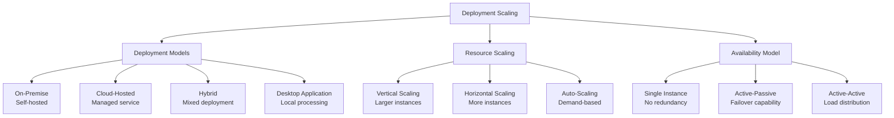

**Scaling Mechanisms:**

1. **Containerized Architecture**
   - Docker containers for processing components
   - Kubernetes orchestration for scaling
   - Helm charts for deployment configuration

2. **Serverless Processing Options**
   - Function-as-Service for code analysis
   - Managed services for rendering
   - Pay-per-use for periodic processing

3. **Hybrid Processing Models**
   - Local processing for sensitive code
   - Cloud processing for intensive tasks
   - Configurable processing location policies

**Deployment Models and Resource Requirements:**

| Deployment Model | Infrastructure Requirements | Scaling Approach | Typical Use Case |
|------------------|---------------------------|------------------|------------------|
| Self-Hosted | On-premise servers or VMs | Manual or orchestrated scaling | High-security environments |
| Managed Cloud | Cloud provider resources | Auto-scaling with load | Standard development teams |
| Hybrid | Mix of on-premise and cloud | Policy-based resource allocation | Regulated industries |
| Desktop Application | End-user devices | Local resource management | Individual developers |
| Embedded Service | Existing CI/CD infrastructure | Piggyback on CI/CD scaling | DevOps-integrated workflows |

### Security Scaling

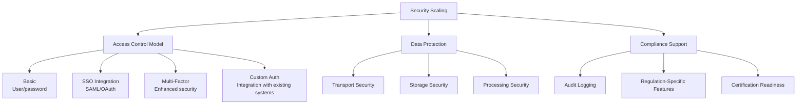

**Scaling Mechanisms:**

1. **Configurable Security Tiers**
   - Basic security for non-sensitive code
   - Enhanced security for proprietary code
   - High-security for regulated environments

2. **Pluggable Authentication & Authorization**
   - Support for multiple authentication methods
   - Integration with existing identity systems
   - Configurable authorization policies

3. **Compliance Framework Support**
   - Audit logging for all operations
   - Data handling compliant with regulations
   - Certification readiness for common standards

**Security Scaling Models:**

| Security Level | Access Controls | Data Protection | Compliance Features | Best For |
|----------------|-----------------|-----------------|---------------------|----------|
| Basic | Simple authentication | Standard encryption | Basic logs | Open source, learning |
| Business | SSO, RBAC | Enhanced encryption, data lifecycle | Audit logs, retention | Enterprise development |
| High-Security | MFA, fine-grained ABAC | Full encryption, secure processing | Full compliance, certifications | Regulated industries |
| Custom | Pluggable to existing systems | Configurable per organization | Organization-specific requirements | Special environments |

## Performance Scaling Techniques

### Processing Optimization

The system employs various techniques to maintain performance as scale increases:

1. **Incremental Processing**
   - Process only what's needed immediately
   - Continue processing in background for completeness
   - Update visualizations incrementally as data becomes available

2. **Caching Architecture**
   ```
   Multi-level caching:
   L1: In-memory component cache (fast, volatile)
   L2: Result cache (processed visualizations)
   L3: Model cache (analyzed code structures)
   L4: Raw analysis cache (initial parsing results)
   ```

3. **Computation Distribution**
   - Distribute analysis across multiple workers
   - Allocate intensive tasks to specialized processors
   - Utilize vectorization for pattern matching operations

4. **Smart Recomputation**
   - Track code changes and affected components
   - Selectively recompute only affected parts
   - Maintain dependency graph for minimal updates

### Rendering Optimization

1. **Adaptive Rendering Strategy**
   ```
   if (components < 100) {
     use SVG for best quality
   } else if (components < 1000) {
     use Canvas for better performance
   } else {
     use WebGL for high-volume rendering
     apply aggressive visual simplification
   }
   ```

2. **Progressive Rendering**
   - Render important components first
   - Add details progressively
   - Prioritize visible viewport area

3. **Interaction-Based Rendering**
   - Full detail only for interaction targets
   - Reduced detail for context elements
   - Background elements simplified to essentials

4. **Viewport Optimization**
   - Render only what's visible in the current viewport
   - Load detail on demand during zooming
   - Unload off-screen components when resources constrained

## Scaling Limitations and Mitigations

### Known Limitations

| Limitation | Impact | Scale Threshold | Mitigation Strategies |
|------------|--------|-----------------|------------------------|
| Code Analysis Performance | Processing time | ~10M LOC | Scheduled batch processing, partial analysis |
| Visualization Complexity | Rendering performance, cognitive load | ~5K components visible | Hierarchical visualization, abstraction levels |
| Concurrent Users | Server resource consumption | ~500 concurrent users per instance | Horizontal scaling, resource pools |
| Real-time Collaboration | Network and synchronization overhead | ~20 simultaneous editors | Operational transforms, conflict resolution |
| Complex Relationship Rendering | Visual clarity, performance | ~10K relationships | Bundling, filtering, progressive disclosure |

### Mitigation Approaches

1. **Decomposition and Boundary Definition**
   - Break large codebases into logical domains
   - Define clear visualization boundaries
   - Create navigation between boundary-limited views

2. **Performance Expectations Management**
   - Clear processing time indicators
   - Background processing with notifications
   - Scheduled processing for very large codebases

3. **Alternative Visualization Modes**
   - Text-based summaries for extreme scale
   - Tabular views for certain relationship types
   - Specialized views for specific analysis needs

## Benchmarking and Measurement

### Key Performance Indicators

| KPI | Formula | Target | Scale Impact |
|-----|---------|--------|--------------|
| Initial Visualization Time | Time from request to first visualization | <30s for 95% of cases | Linear with code size |
| Interaction Response Time | Time from user action to response | <200ms for 95% of interactions | Minimal with proper optimization |
| Memory Consumption | Peak memory usage during visualization | <2GB for client, <4GB for server | Sub-linear with proper optimization |
| Concurrent User Support | Max users with acceptable performance | Scales with infrastructure | Linear with infrastructure |
| Rendering Performance | Frames per second during interaction | >30 FPS for interactive operations | Dependent on complexity and rendering engine |

### Benchmark Configurations

1. **Small Project Benchmark**
   - 50K LOC, 5 modules, ~100 classes
   - Single-user mode
   - Full processing expected

2. **Medium Project Benchmark**
   - 500K LOC, 20 modules, ~500 classes
   - Team environment (10 concurrent users)
   - Interactive response prioritized

3. **Large Project Benchmark**
   - 5M LOC, 100 modules, ~2000 classes
   - Enterprise environment (50 concurrent users)
   - Background processing accepted

4. **Scaled Concurrent Usage Benchmark**
   - Medium codebase with increasing concurrent users
   - Measure degradation points
   - Identify bottlenecks

## Conclusion

The Super Simple Code Framework Visualizer scalability model provides a comprehensive approach to handling growth across multiple dimensions: code scale, user scale, functional scale, organizational scale, and deployment scale. By implementing the identified scaling mechanisms and following the tiered approaches for different scale levels, the system can effectively grow from individual developer use to enterprise-wide deployment.

Key scaling principles include:

1. **Progressive Processing and Rendering** - Start with what's immediately needed and expand
2. **Multi-Tiered Architecture** - Adapt components based on scale requirements
3. **Hierarchical Visualization** - Provide appropriate abstraction for complexity
4. **Resource Optimization** - Allocate resources based on importance and usage
5. **Flexible Deployment Models** - Support different infrastructure needs

This scalability model ensures the visualization system can maintain its core value proposition - making complex code understandable through an "ELI5" approach - regardless of the scale at which it operates.