# Super Simple Code Framework Visualizer - Integration Strategy

This document outlines a comprehensive strategy for integrating the Super Simple Code Framework Visualizer into broader development ecosystems, enabling seamless workflows and maximizing the system's value across different platforms and processes.

## Integration Vision

The Super Simple Code Framework Visualizer can serve as a central knowledge hub that connects various development tools, processes, and stakeholders. This integration strategy aims to position the visualization system as a bridge between technical implementation and conceptual understanding across the entire software development lifecycle.

```mermaid
flowchart TD
    classDef primary fill:#f96,stroke:#333,stroke-width:2px
    classDef secondary fill:#69f,stroke:#333,stroke-width:1px
    classDef tertiary fill:#6f6,stroke:#333,stroke-width:1px

    VisualizerSystem[Super Simple Code Framework Visualizer] :::primary
    
    subgraph DevelopmentEnvironments [Development Environments]
        IDEs[IDEs & Code Editors]
        GitClients[Git Clients]
        CLITools[CLI Development Tools]
    end
    
    subgraph CollaborationPlatforms [Collaboration Platforms]
        JIRA[Issue Tracking]
        Confluence[Documentation Wiki]
        Teams[Team Communication]
    end
    
    subgraph ContinuousIntegration [CI/CD Pipeline]
        GitHubActions[GitHub Actions]
        Jenkins[Jenkins]
        BuildProcesses[Build Processes]
    end
    
    subgraph LearningPlatforms [Learning Platforms]
        LMS[Learning Management Systems]
        TrainingModules[Training Modules]
        OnboardingTools[Onboarding Systems]
    end
    
    subgraph MonitoringSystems [Monitoring & Analytics]
        APM[Application Performance]
        Analytics[Usage Analytics]
        Logging[Logging Systems]
    end
    
    VisualizerSystem <--> DevelopmentEnvironments
    VisualizerSystem <--> CollaborationPlatforms
    VisualizerSystem <--> ContinuousIntegration
    VisualizerSystem <--> LearningPlatforms
    VisualizerSystem <--> MonitoringSystems
```

## Integration Categories

### 1. Development Environment Integrations

These integrations embed visualization capabilities directly into developers' everyday tools.

#### IDE Extensions & Plugins

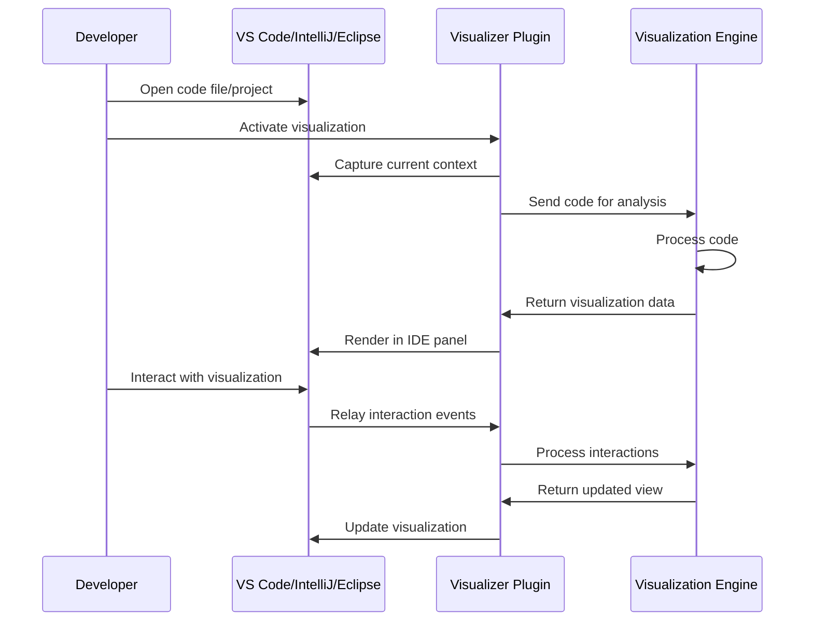

**Key Features:**
- Side-by-side code and visualization panels
- Click in visualization to navigate to actual code
- Automatic updates as code changes
- Contextual help based on current file/class

**Technical Approach:**
1. Develop extensions for popular IDEs (VS Code, IntelliJ, Eclipse)
2. Use language server protocol for code parsing
3. Implement lightweight rendering in IDE context
4. Provide synchronization between code and visualization views

#### Git Client Integration

```mermaid
flowchart LR
    GitOps[Git Operations] --> GitHook[Git Hooks]
    GitHook --> Trigger[Trigger Visualization]
    
    subgraph VisualizationFlow
        Trigger --> DiffAnalysis[Analyze Code Changes]
        DiffAnalysis --> UpdateModel[Update Visualization Model]
        UpdateModel --> GenerateView[Generate Diff Visualization]
        GenerateView --> DisplayChanges[Display Impact Visualization]
    end
    
    subgraph MergeReviewFlow
        DisplayChanges --> PullRequest[Pull Request View]
        PullRequest --> MergeDecision[Merge Decision Support]
    end
```

**Key Features:**
- Visualize changes between commits/branches
- Show impact of changes on overall system
- Enhance pull request reviews with visual context
- Highlight architectural impacts of changes

**Technical Approach:**
1. Create Git hooks for visualization triggers
2. Develop diff-specific visualization modes
3. Integrate with GitHub/GitLab APIs for PR integration
4. Implement server-side rendering for sharing in PR context

### 2. Collaboration Platform Integrations

These integrations bring visualizations into team collaboration tools to enhance communication and shared understanding.

#### Documentation System Integration

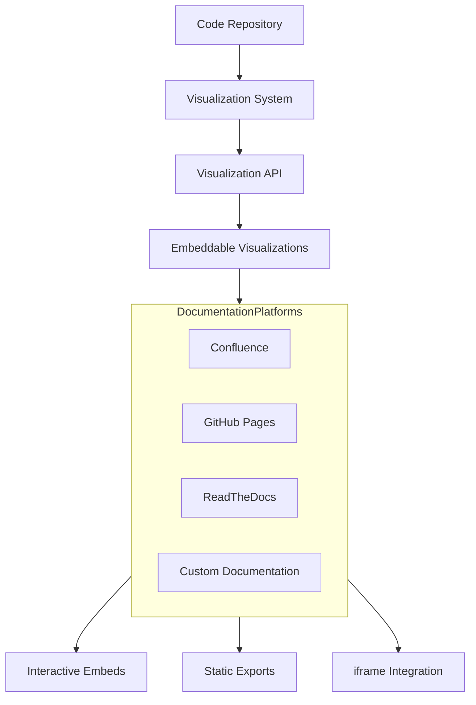

**Key Features:**
- Embeddable visualizations in documentation
- Live-updating diagrams linked to current codebase
- Interactive components in otherwise static documentation
- Export/import between visualization and documentation systems

**Technical Approach:**
1. Create embed codes/iframes for easy inclusion
2. Develop specialized export formats for documentation systems
3. Create webhooks for live updates when code changes
4. Implement screenshot/static image generation for compatibility

#### Team Communication Integration

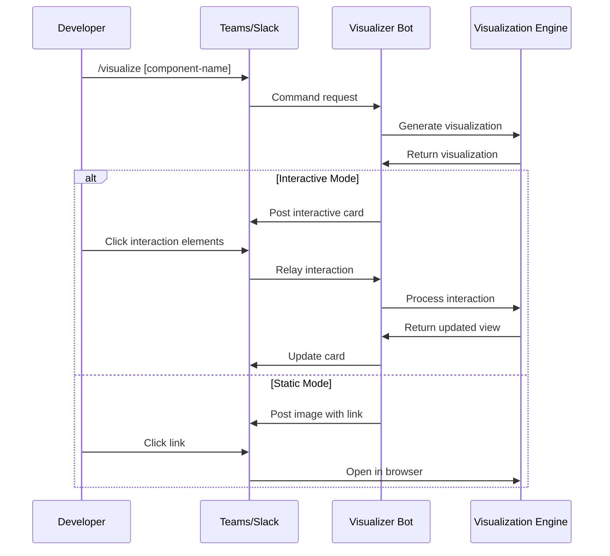

**Key Features:**
- Slash commands to generate visualizations
- Visualization bots for team channels
- Share and discuss visualizations in chat context
- Quick visualization snippets for discussions

**Technical Approach:**
1. Develop chatbots for Teams, Slack, and Discord
2. Create shareable visualization links with context
3. Implement adaptive rendering for chat interfaces
4. Use interactive message cards where supported

### 3. CI/CD Pipeline Integrations

These integrations generate visualizations automatically as part of the development pipeline.

#### Automated Documentation Generation

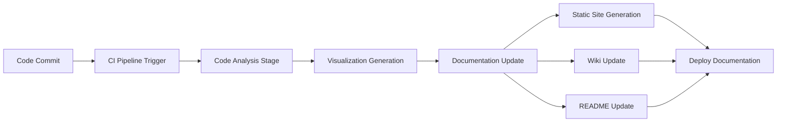

**Key Features:**
- Auto-generate visualizations on code changes
- Include updated visualizations in documentation builds
- Version visualizations alongside code
- Create visual diffs between versions

**Technical Approach:**
1. Create GitHub Actions/Jenkins plugins for visualization
2. Integrate with static site generators (Jekyll, Hugo, etc.)
3. Build automation for README visualization updates
4. Implement documentation-specific rendering modes

#### Architecture Validation Pipeline

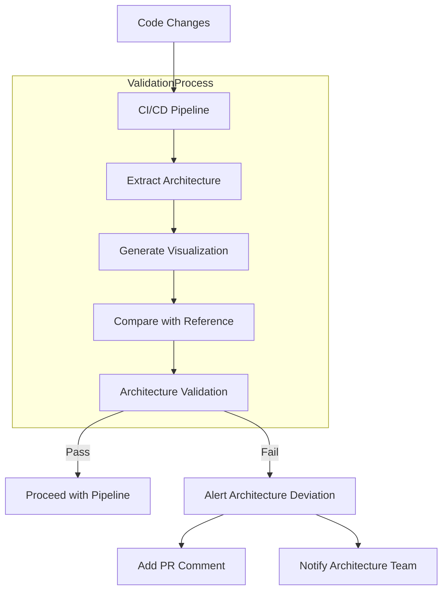

**Key Features:**
- Validate code changes against architectural standards
- Visualize architectural drift
- Ensure code changes maintain design patterns
- Prevent architectural degradation

**Technical Approach:**
1. Define architecture models with visualization system
2. Create validation rules for architectural compliance
3. Implement comparison algorithms for structure matching
4. Build notification and reporting systems for violations

### 4. Learning Platform Integrations

These integrations leverage visualizations for educational purposes across various learning contexts.

#### LMS Integration

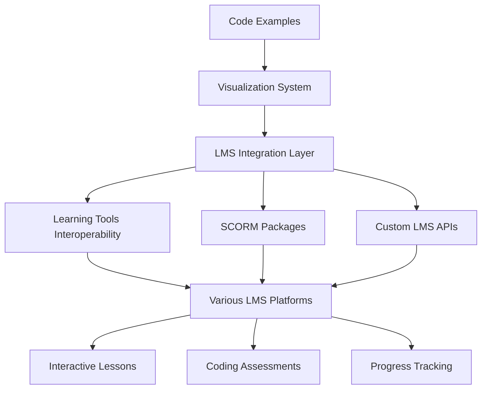

**Key Features:**
- Interactive coding lessons with visualizations
- Visual explanation of programming concepts
- Progress tracking through concept understanding
- Self-assessment using visualization comprehension

**Technical Approach:**
1. Implement LTI (Learning Tools Interoperability) provider
2. Create SCORM-compatible visualization packages
3. Develop assessment tools based on visualization understanding
4. Build progress tracking based on concept mastery

#### Onboarding System Integration

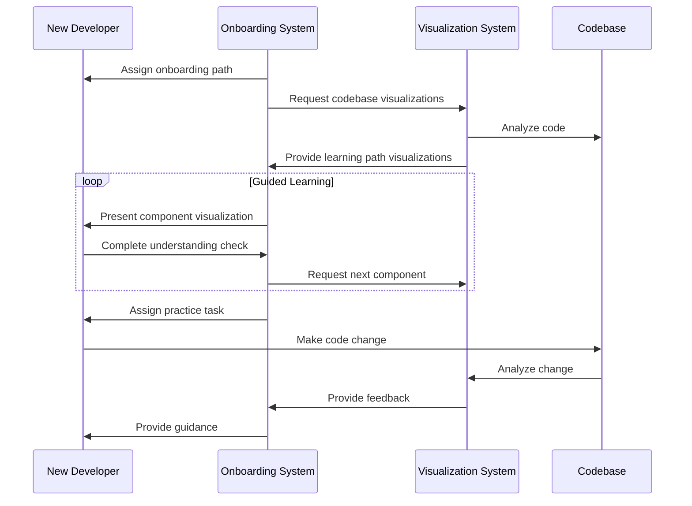

**Key Features:**
- Structured learning path through codebase
- Progressive disclosure of system complexity
- Hands-on tasks with visual guidance
- Understanding verification through interactive challenges

**Technical Approach:**
1. Create onboarding pathways through visualization
2. Develop progressive component revelation
3. Implement understanding verification quizzes
4. Build change impact visualization for learning tasks

### 5. Monitoring and Analytics Integrations

These integrations connect runtime behavior with code visualization to provide context for operational data.

#### APM Integration

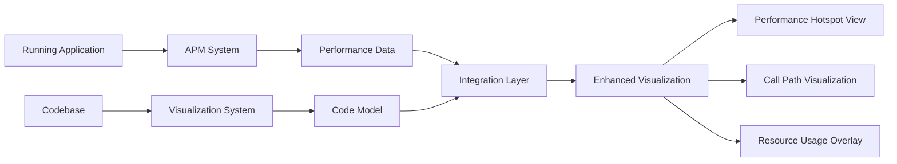

**Key Features:**
- Overlay performance data on code visualizations
- Highlight performance hotspots in visual model
- Trace execution paths through visualization
- Connect logs/errors to relevant code components

**Technical Approach:**
1. Create data connectors for popular APM tools (New Relic, Datadog, etc.)
2. Develop performance data visualization overlays
3. Implement trace visualization on code paths
4. Build alerting with visualization context

#### Usage Analytics Integration

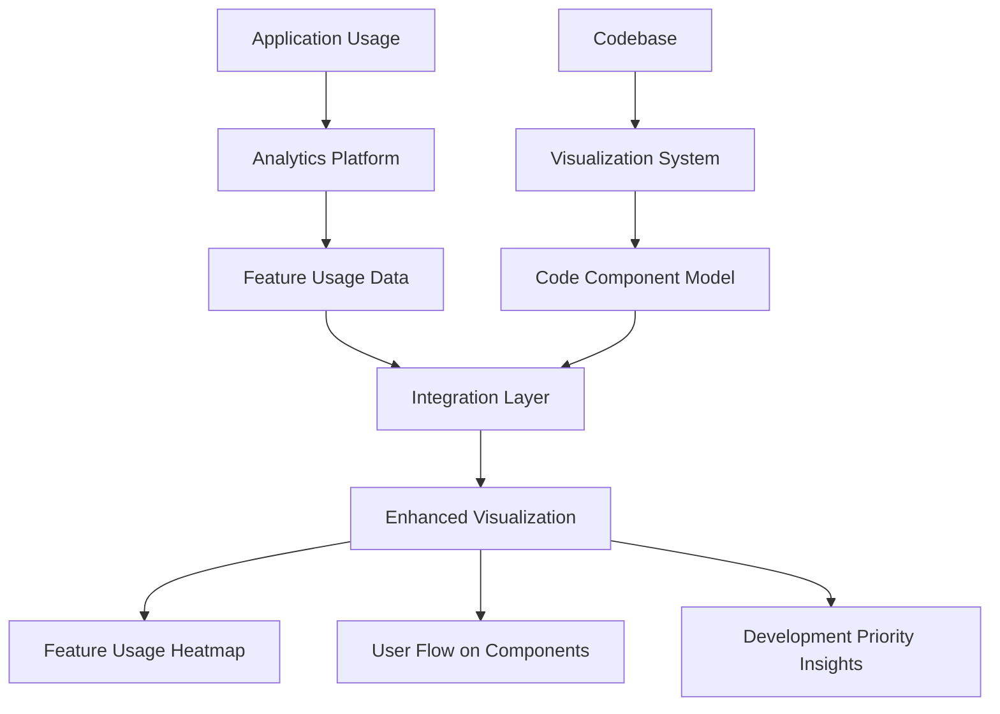

**Key Features:**
- Visualize feature usage in context of code
- Map user journeys to code components
- Identify high-impact code areas
- Guide refactoring and optimization efforts

**Technical Approach:**
1. Develop connectors for analytics platforms (Google Analytics, Mixpanel, etc.)
2. Create usage data mapping to code components
3. Implement visualization overlays for usage patterns
4. Build reporting tools for development prioritization

## Platform-Specific Integration Approaches

### 1. GitHub Integration

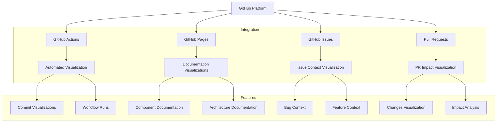

**Implementation Strategy:**
1. Create GitHub App for repository integration
2. Develop GitHub Actions for automated visualization
3. Build GitHub Pages integration for documentation
4. Implement visualization previews in issues and PRs

**Key Endpoints:**
- GitHub Webhooks for change detection
- GitHub API for repository content access
- GitHub Pages for static content hosting
- GitHub Checks API for PR integration

### 2. Atlassian Suite Integration

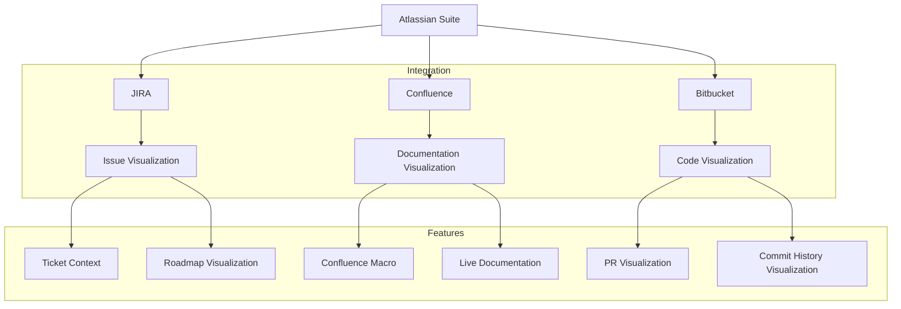

**Implementation Strategy:**
1. Create Atlassian Connect app for suite integration
2. Develop Confluence macros for embedding visualizations
3. Build JIRA issue glance for code context
4. Implement Bitbucket PR integration

**Key Endpoints:**
- Atlassian Connect lifecycle hooks
- Confluence Content REST API
- JIRA Issue API
- Bitbucket API for code access

### 3. Microsoft 365 Integration

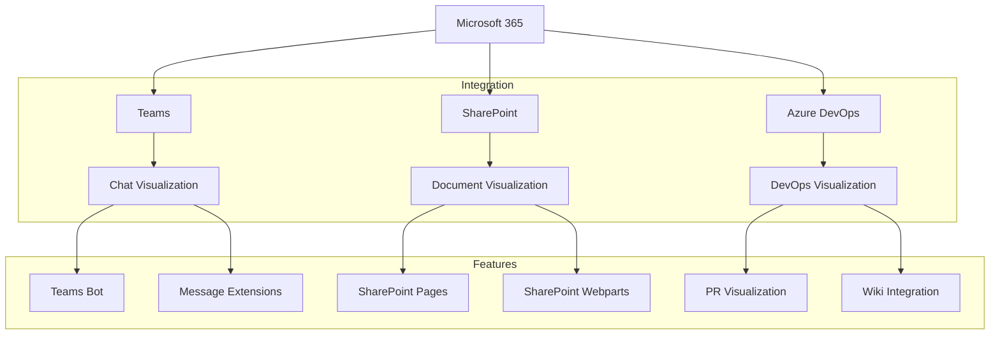

**Implementation Strategy:**
1. Develop Teams bot for chat-based visualization
2. Create SharePoint webparts for embedding
3. Build Azure DevOps extensions for pipeline integration
4. Implement Single Sign-On across components

**Key Endpoints:**
- Microsoft Graph API
- Teams Bot Framework
- SharePoint Framework
- Azure DevOps Extension API

## API Design for Integration

To support the diverse integration scenarios, the Visualization System will provide the following API endpoints:

### 1. Visualization Generation API

```
POST /api/visualize

Request:
{
  "codeSource": {
    "type": "repository|files|snippet",
    "location": "github://org/repo|file://path|snippet",
    "branch": "main", // Optional
    "commitHash": "abc123", // Optional
    "path": "src/", // Optional subdirectory
  },
  "visualizationType": "complete|component|flow|changes",
  "focusComponent": "Authentication", // Optional
  "renderOptions": {
    "style": "detailed|simplified|minimal",
    "includeNarrative": true,
    "interactivityLevel": "none|basic|full"
  },
  "outputFormat": "html|json|svg|png"
}

Response:
{
  "visualizationId": "viz-123456",
  "status": "complete|processing",
  "estimatedProcessingTime": 5, // seconds, if processing
  "result": {
    "contentType": "text/html|application/json|image/svg+xml|image/png",
    "content": "...", // Base64 encoded or JSON structure depending on format
    "metadata": {
      "componentCount": 10,
      "relationshipCount": 15,
      "generatedAt": "2025-04-29T16:45:00Z"
    }
  },
  "embeddingCode": "<iframe src='...'></iframe>" // For HTML output
}
```

### 2. Interactive Visualization API

```
POST /api/visualize/interact

Request:
{
  "visualizationId": "viz-123456",
  "interactionType": "focus|expand|explore|playAnimation",
  "target": "ComponentName|RelationshipId",
  "parameters": {
    // Specific to interaction type
  }
}

Response:
{
  "updatedVisualization": {
    "contentType": "text/html|application/json",
    "content": "...", // Updated visualization
    "targetState": "focused|expanded|explored"
  }
}
```

### 3. Webhook Integration API

```
POST /api/integrations/webhook

Request:
{
  "event": "code.push|pr.created|issue.created",
  "source": "github|gitlab|bitbucket|azure-devops",
  "payload": {
    // Platform-specific webhook payload
  },
  "visualizationConfig": {
    // Configuration for visualization generation
  }
}

Response:
{
  "status": "accepted|rejected",
  "processingId": "process-123456",
  "estimatedCompletionTime": 15, // seconds
  "callbackUrl": "https://api.visualizer.example/webhook-result/process-123456"
}
```

### 4. Embedding API

```
GET /api/embed/{visualizationId}

Query Parameters:
- theme: light|dark|auto
- interactive: true|false
- showNarrative: true|false
- width: auto|{pixels}
- height: auto|{pixels}

Response:
HTML content for embedding
```

## Security and Authentication

### 1. Authentication Methods

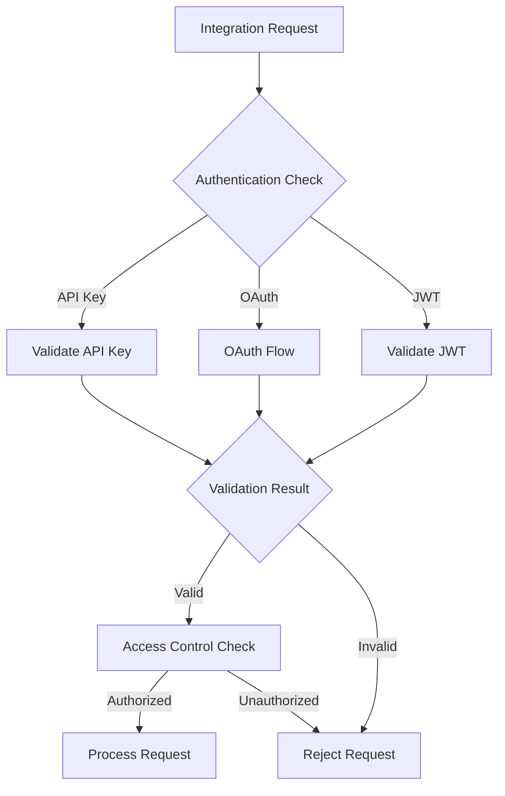

**Implementation Details:**
1. API Key-based authentication for system integrations
2. OAuth 2.0 flows for user-context operations
3. JWT support for single sign-on scenarios
4. PKCE flow for client-side applications

### 2. Permission Scopes

| Scope | Description | Use Cases |
|-------|-------------|-----------|
| `code:read` | Read access to code sources | Basic visualization |
| `visualization:generate` | Generate visualizations | Creating new visualizations |
| `visualization:interact` | Interact with visualizations | Interactive embedding |
| `webhook:receive` | Receive webhooks | CI/CD integration |
| `analytics:read` | Read usage analytics | Performance monitoring |
| `settings:write` | Modify integration settings | Admin configuration |

## Implementation Roadmap

### Phase 1: Core API Foundation

1. Develop Visualization Generation API
2. Implement basic authentication
3. Create embedding functionality
4. Build foundation for IDE extensions

### Phase 2: Primary Integration Points

1. Develop GitHub integration
2. Create VS Code extension
3. Build documentation system connectors
4. Implement Teams/Slack bot

### Phase 3: Enterprise Integration Suite

1. Develop Atlassian suite integration
2. Create Azure DevOps integration
3. Build LMS integration components
4. Implement CI/CD pipeline connectors

### Phase 4: Extended Ecosystem

1. Create APM integration
2. Develop analytics connection layer
3. Build custom integration SDK
4. Implement advanced embedding features

## Integration Governance

### 1. Integration Lifecycle Management

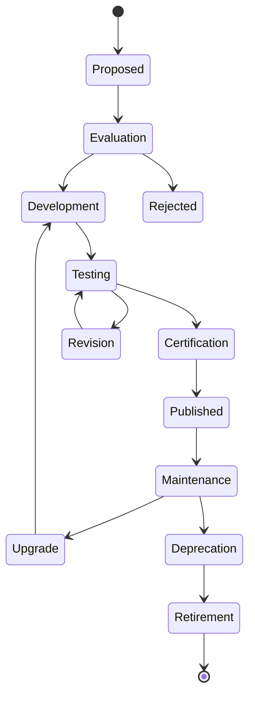

### 2. Integration Standards

1. **API Consumption Standards**
   - Rate limiting compliance
   - Efficient resource utilization
   - Proper error handling
   - Version compatibility management

2. **Security Requirements**
   - Credential protection
   - Permission scope limiting
   - Data minimization
   - Encryption for sensitive data

3. **User Experience Guidelines**
   - Consistent visual language
   - Intuitive interaction patterns
   - Responsive embedding
   - Accessibility compliance

4. **Documentation Requirements**
   - Integration setup instructions
   - API reference
   - Example implementations
   - Troubleshooting guides

## Conclusion

This integration strategy positions the Super Simple Code Framework Visualizer as a central element in the software development ecosystem. By connecting to key platforms and tools across the entire development lifecycle, the visualization system can provide continuous value through enhanced understanding and communication.

The implementation approach balances quick wins (IDE plugins, documentation embedding) with strategic enterprise integrations (CI/CD, LMS, APM). This ensures both immediate utility and long-term ecosystem presence.

By following this strategy, the visualization system will transcend its role as a standalone tool to become a ubiquitous layer of understanding across the entire software development process - from initial design through development, review, deployment, monitoring, and education.