# Interactive Visualization Examples

This document provides mockups of how the Document Unification System would appear when visualized using the Super Simple Code Framework Visualizer approach. These examples show the transformation from complex code into intuitive, story-based visualizations.

## System Overview Visualization

Below is a mockup of how the high-level system overview would appear in the visualization:

```mermaid
graph TD
    classDef house fill:#f5f5f5,stroke:#333,stroke-width:2px
    classDef person fill:#e1f5fe,stroke:#333,stroke-width:2px
    classDef toy fill:#e8f5e9,stroke:#333,stroke-width:2px
    classDef note fill:#fff8e1,stroke:#333,stroke-width:1px
    classDef plug fill:#f3e5f5,stroke:#333,stroke-width:2px
    
    DocSystem[🏰 Document System]
    
    DocSystem --> AgentsHouse[🏠 Agents House]
    DocSystem --> UtilsHouse[🏠 Utils House]
    DocSystem --> StorageHouse[🏠 Storage House]
    DocSystem --> AuthHouse[🏠 Security House]
    
    AgentsHouse --> MayorPerson[👤 Mayor<br>Orchestrator Agent]
    AgentsHouse --> InspectorPerson[👤 Inspector<br>Parser Agent]
    AgentsHouse --> CatalogerPerson[👤 Cataloger<br>Metadata Agent]
    AgentsHouse --> CheckerPerson[👤 Checker<br>Validator Agent]
    AgentsHouse --> BuilderPerson[👤 Builder<br>Code Building Agent]
    
    UtilsHouse --> MessagesToy[📦 Messages Box<br>Messaging System]
    UtilsHouse --> StateCabinetToy[📦 State Cabinet<br>State Management]
    UtilsHouse --> MaterialsToy[📦 Materials Kit<br>Model Selection]
    UtilsHouse --> AdaptersToy[📦 Connection Tools<br>Adapters]
    
    StorageHouse --> StorageManagerPerson[👤 Storage Manager<br>Storage Interface]
    StorageHouse --> SupabaseVaultToy[📦 Supabase Vault<br>Supabase Storage]
    StorageHouse --> S3WarehouseToy[📦 S3 Warehouse<br>S3 Storage]
    StorageHouse --> LocalCabinetToy[📦 Local Cabinet<br>Local Storage]
    
    AuthHouse --> SecurityGuardPerson[👤 Security Guard<br>Auth System]
    AuthHouse --> IDCardToy[📦 ID Card Maker<br>JWT Manager]
    AuthHouse --> RuleBookToy[📦 Rule Book<br>Permissions]
    AuthHouse --> LogBookToy[📦 Log Book<br>Audit System]
    
    MayorPerson --> PlanningNote[📝 Workflows Config<br>orchestration settings]
    InspectorPerson --> ParsingNote[📝 Parser Rules<br>parsing configuration]
    SecurityGuardPerson --> SecurityNote[📝 Security Rules<br>auth configuration]
    
    DocSystem --> ExternalAPIPlug[🔌 External API<br>External Services]
    StorageManagerPerson --> DatabasePlug[🔌 Database<br>Data Connection]
    
    class DocSystem house
    class AgentsHouse,UtilsHouse,StorageHouse,AuthHouse house
    class MayorPerson,InspectorPerson,CatalogerPerson,CheckerPerson,BuilderPerson,StorageManagerPerson,SecurityGuardPerson person
    class MessagesToy,StateCabinetToy,MaterialsToy,AdaptersToy,SupabaseVaultToy,S3WarehouseToy,LocalCabinetToy,IDCardToy,RuleBookToy,LogBookToy toy
    class PlanningNote,ParsingNote,SecurityNote note
    class ExternalAPIPlug,DatabasePlug plug
```



## Interactive Features

In the actual implementation, users could:

- **Click on any component** to see detailed information
- **Hover over connections** to see relationship descriptions
- **Zoom in/out** to focus on specific areas
- **Drag components** to reorganize the view
- **Filter by type** (houses, people, toys, etc.)

## Document Processing Workflow Visualization

This mockup shows how the document processing workflow would be visualized:

```mermaid
graph LR
    classDef document fill:#f5f5f5,stroke:#333,stroke-width:2px
    classDef person fill:#e1f5fe,stroke:#333,stroke-width:2px
    classDef action fill:#e8f5e9,stroke:#333,stroke-width:2px
    classDef processed fill:#fff8e1,stroke:#333,stroke-width:2px
    
    Doc[📄 New Document] --> Mayor[👤 Mayor<br>Orchestrator]
    
    Mayor -- "Step 1: Review" --> Inspector[👤 Inspector<br>Parser]
    Inspector -- "Looking inside" --> InspectAction[🔍 Reading Document]
    InspectAction -- "Found content" --> StructuredDoc[📄 Structured Content]
    
    StructuredDoc --> Mayor
    Mayor -- "Step 2: Organize" --> Cataloger[👤 Cataloger<br>Metadata]
    Cataloger -- "Organizing" --> CatalogAction[🏷️ Tagging Content]
    CatalogAction -- "Added metadata" --> TaggedDoc[📄 Tagged Document]
    
    TaggedDoc --> Mayor
    Mayor -- "Step 3: Verify" --> Checker[👤 Checker<br>Validator]
    Checker -- "Checking" --> CheckAction[✓ Validating]
    CheckAction -- "Confirmed correct" --> ValidatedDoc[📄 Validated Document]
    
    ValidatedDoc --> Mayor
    Mayor -- "Step 4: Save" --> Storage[👤 Storage Manager]
    Storage -- "Archiving" --> SaveAction[💾 Storing Document]
    SaveAction -- "Safely stored" --> ArchivedDoc[📄 Archived Document<br>Processing Complete!]
    
    class Doc,StructuredDoc,TaggedDoc,ValidatedDoc,ArchivedDoc document
    class Mayor,Inspector,Cataloger,Checker,Storage person
    class InspectAction,CatalogAction,CheckAction,SaveAction action
    class ArchivedDoc processed
```



## Code Component View

This mockup shows how a specific code component would be visualized:

```mermaid
graph TD
    classDef person fill:#e1f5fe,stroke:#333,stroke-width:2px
    classDef toy fill:#e8f5e9,stroke:#333,stroke-width:2px
    classDef ability fill:#fff8e1,stroke:#333,stroke-width:1px
    
    MayorPerson[👤 Mayor<br>Orchestrator Agent] --> CoordinateToy[📦 Coordination Tool<br>process_document()]
    MayorPerson --> PlanToy[📦 Planning Tool<br>create_workflow()]
    MayorPerson --> MonitorToy[📦 Monitoring Tool<br>check_status()]
    MayorPerson --> DelegateToy[📦 Delegation Tool<br>assign_task()]
    
    CoordinateToy --> AbilityA[✨ Can manage complete processing]
    CoordinateToy --> AbilityB[✨ Can handle different document types]
    
    PlanToy --> AbilityC[✨ Can create optimized workflows]
    PlanToy --> AbilityD[✨ Can adapt to document complexity]
    
    MonitorToy --> AbilityE[✨ Can track all processing stages]
    MonitorToy --> AbilityF[✨ Can detect and report issues]
    
    DelegateToy --> AbilityG[✨ Can assign tasks to specialists]
    DelegateToy --> AbilityH[✨ Can balance workload]
    
    class MayorPerson person
    class CoordinateToy,PlanToy,MonitorToy,DelegateToy toy
    class AbilityA,AbilityB,AbilityC,AbilityD,AbilityE,AbilityF,AbilityG,AbilityH ability
```

## Narrative Explanation Example

Below each visualization, a narrative explanation would appear, similar to this:

> ### The Mayor's Office
> 
> The Mayor (Orchestrator Agent) is in charge of the whole document processing city! 
> 
> When a new document arrives, the Mayor looks at it and creates a special plan. First, the Mayor asks the Inspector to read through the document carefully. The Inspector uses special glasses to see what's inside and reports back everything found.
> 
> Next, the Mayor sends this information to the Cataloger, who puts special tags on all the important parts so they're easy to find later. After tagging is done, the Mayor asks the Checker to make sure everything is correct and nothing is missing.
> 
> Finally, when everything is checked and perfect, the Mayor tells the Storage Manager to put the document in the right place so it can be found again when needed.
> 
> The Mayor has special tools to help with all this work:
> - A Coordination Tool to keep track of the whole process
> - A Planning Tool to figure out the best way to handle each document
> - A Monitoring Tool to make sure everything is going well
> - A Delegation Tool to give tasks to the right specialists
> 
> Just like a real mayor keeps a city running smoothly, the Orchestrator Agent makes sure all documents are processed correctly from start to finish!

## Interactive Animation Mockup

In the actual implementation, users could play an animated walkthrough of the workflow:

```mermaid
sequenceDiagram
    actor Doc as 📄 Document
    participant Mayor as 👤 Mayor
    participant Inspector as 👤 Inspector
    participant Cataloger as 👤 Cataloger
    participant Checker as 👤 Checker
    participant StorageMgr as 👤 Storage Manager
    
    Note over Doc,StorageMgr: Document Processing Workflow Animation
    
    Doc->>Mayor: Arrives at city
    Note over Mayor: Reviews document
    
    Mayor->>Inspector: "Please examine this"
    Note over Inspector: Reads document carefully
    Inspector->>Mayor: "Here's what I found"
    
    Mayor->>Cataloger: "Please organize this"
    Note over Cataloger: Tags and categorizes
    Cataloger->>Mayor: "All organized!"
    
    Mayor->>Checker: "Please verify this"
    Note over Checker: Checks for errors
    Checker->>Mayor: "All verified!"
    
    Mayor->>StorageMgr: "Please store this"
    Note over StorageMgr: Safely archives
    StorageMgr->>Mayor: "Safely stored!"
    
    Note over Doc,StorageMgr: Processing Complete!
```



## Model Selection Visualization

This mockup shows how the model selection process would be visualized:

```mermaid
graph TD
    classDef person fill:#e1f5fe,stroke:#333,stroke-width:2px
    classDef toy fill:#e8f5e9,stroke:#333,stroke-width:2px
    classDef material fill:#fff8e1,stroke:#333,stroke-width:1px
    classDef task fill:#f3e5f5,stroke:#333,stroke-width:1px
    
    Task[🎯 Code Generation Task] --> MaterialExpert[👤 Materials Expert<br>Model Selection Agent]
    
    MaterialExpert --> Registry[📦 Materials Catalog<br>Model Registry]
    MaterialExpert --> CriteriaAnalyzer[📦 Requirements Analyzer<br>Selection Criteria]
    MaterialExpert --> Measurer[📦 Measuring Tool<br>Metrics Collector]
    
    Registry --> GPT4[✨ GPT-4<br>Complex reasoning]
    Registry --> Claude[✨ Claude<br>Code generation]
    Registry --> LLaMA[✨ LLaMA<br>Fast processing]
    Registry --> Custom[✨ Custom Model<br>Domain-specific]
    
    CriteriaAnalyzer --> TaskComplexity[📋 Task Complexity]
    CriteriaAnalyzer --> SpecialKnowledge[📋 Specialized Knowledge]
    CriteriaAnalyzer --> PerformancePriority[📋 Performance Priority]
    
    MaterialExpert --> SelectedModel[✨ Selected Model<br>Best for the job]
    Task --> BuiltCode[🏗️ Generated Code]
    
    class Task,BuiltCode task
    class MaterialExpert person
    class Registry,CriteriaAnalyzer,Measurer toy
    class GPT4,Claude,LLaMA,Custom,SelectedModel material
    class TaskComplexity,SpecialKnowledge,PerformancePriority task
```



## Authentication Flow Visualization

This mockup shows how the authentication process would be visualized:

```mermaid
graph TD
    classDef person fill:#e1f5fe,stroke:#333,stroke-width:2px
    classDef toy fill:#e8f5e9,stroke:#333,stroke-width:2px
    classDef item fill:#fff8e1,stroke:#333,stroke-width:1px
    classDef decision fill:#f3e5f5,stroke:#333,stroke-width:2px
    
    Visitor[👤 Visitor<br>User] --> Guard[👤 Security Guard<br>Middleware]
    
    Guard --> IDCheck[📦 ID Checker<br>JWT Manager]
    Guard --> RuleBook[📦 Rule Book<br>Permissions]
    Guard --> LogBook[📦 Log Book<br>Audit Logger]
    
    Visitor --> IDCard[🪪 JWT Token<br>User Credentials]
    IDCard --> IDCheck
    
    IDCheck -->|Verify| VerifyResult{Is ID Valid?}
    VerifyResult -->|Yes| GuardCheck{Check Permissions}
    VerifyResult -->|No| Denied[❌ Access Denied<br>"Invalid Credentials"]
    
    GuardCheck --> RuleBook
    RuleBook --> PermissionResult{Has Permission?}
    PermissionResult -->|Yes| Granted[✅ Access Granted<br>"Welcome!"]
    PermissionResult -->|No| Forbidden[❌ Access Denied<br>"Not Authorized"]
    
    Denied --> LogBook
    Forbidden --> LogBook
    Granted --> LogBook
    
    class Visitor,Guard person
    class IDCheck,RuleBook,LogBook toy
    class IDCard,Denied,Forbidden,Granted item
    class VerifyResult,PermissionResult decision
```

## Implementation Notes

In the actual implementation, these visualizations would:

1. **Be fully interactive** - with clickable elements and animations
2. **Scale to any codebase** - automatically generating appropriate visualizations
3. **Include audio narration** - explaining the concepts in simple terms
4. **Offer customization** - allowing users to adjust detail level and focus
5. **Support embedding** - for inclusion in documentation and presentations

These mockups demonstrate how the Super Simple Code Framework Visualizer would transform complex technical concepts into intuitive, story-based visualizations that can be understood by both technical and non-technical stakeholders.