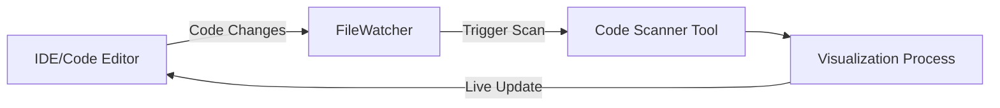
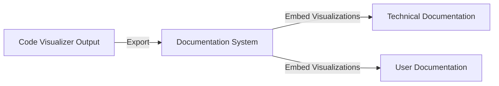
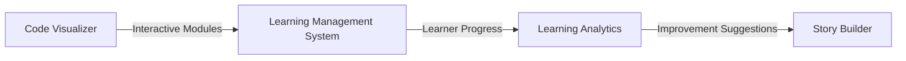
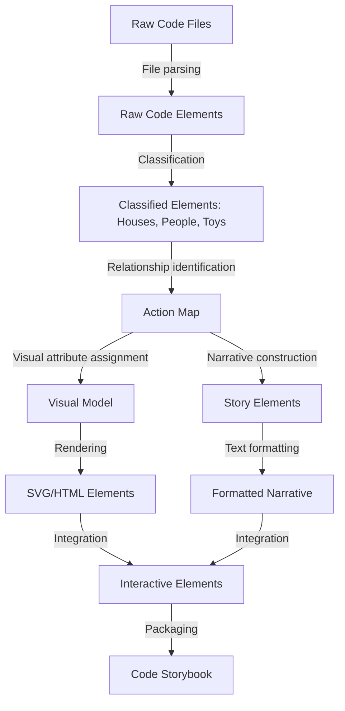

# Super Simple Code Framework Visualizer - Process Analysis

## Process Flow Optimization Opportunities

After modeling the complete process flow of the Super Simple Code Framework Visualizer system, I've identified several optimization opportunities and integration points that could enhance the system's functionality and user experience:

### 1. Parallel Processing Opportunities

The current process model identifies one key parallel processing opportunity:
- **Abstract Modeling → Visual Generation AND Narrative Generation** can occur simultaneously after the structured model is created

Additional parallelization opportunities include:

1. **Sub-component parallelization within the Code Scanner**:
   - File reading operations can be parallelized across multiple files
   - Component identification (houses, people, toys) can be processed concurrently

2. **Rendering optimizations**:
   - Pre-compute layout information during the Visual Data Generation stage
   - Generate SVG templates and CSS styling in parallel with data preparation

### 2. Feedback Loops

The current linear process could benefit from feedback loops:

1. **Visualization Quality Feedback Loop**:
   - Add a validation stage after Visual Rendering to assess diagram clarity
   - Use results to refine the Abstract Modeling rules for better visualizations

2. **Narrative Improvement Loop**:
   - Collect metrics on narrative clarity and comprehension
   - Feed this data back to refine the Story Builder's analogies and explanations

## Integration Points

The following integration points would allow the Visualizer to connect with external systems:

### 1. Development Environment Integration

### 2. Documentation System Integration

### 3. Training System Integration

## Component Relationships Matrix

| Component | Provides To | Consumes From |
|-----------|-------------|---------------|
| **Code Scanner Tool** | Ingredient list (houses, people, toys) → Building Blocks System | Codebase files |
| **Building Blocks System** | Structured model → Picture Maker, Relationships → Story Builder | Ingredient list from Code Scanner |
| **Picture Maker** | Visualization data → D3.js Renderer | Structured model from Building Blocks System |
| **Story Builder** | Narrative text → Interactive Layer | Relationships from Building Blocks System |
| **D3.js Renderer** | HTML/SVG diagrams → Interactive Layer | Visualization data from Picture Maker |
| **Interactive Layer** | Interactive webapp → Export System | HTML/SVG from Renderer, Narrative from Story Builder |
| **Export System** | Shareable code storybooks → End User | Complete interactive visualization |

## Resource Allocation Recommendations

Based on process complexity analysis:

1. **High Resource Allocation Priority**:
   - **Building Blocks System**: Central to quality output, requires sophisticated mapping
   - **Interactive Layer**: Critical for user experience, involves complex frontend development

2. **Medium Resource Allocation Priority**:
   - **Story Builder**: Important for explanatory quality
   - **Picture Maker**: Affects visual clarity and appeal

3. **Lower Resource Allocation Priority**:
   - **Code Scanner Tool**: Relatively straightforward functionality
   - **Export System**: Standard functionality

## Enhanced Data Flow Analysis

### Data Transformations

### Data Enrichment Points

1. **Post-Scanning Enrichment**:
   - Metadata extraction (code complexity, documentation level)
   - Usage statistics (function call frequency)

2. **Narrative Enrichment**:
   - External analogy database integration
   - Domain-specific terminology adaptation

3. **Visualization Enrichment**:
   - Theme application (cartoon, technical, minimalist)
   - Accessibility enhancements (colorblind-friendly, screen reader support)

## Implementation Phasing Recommendation

### Phase 1: Minimum Viable Product
- Basic Code Scanner implementation
- Simple Building Blocks classification
- Static visualization generation
- Basic narrative generation

### Phase 2: Enhanced Visualization
- Complete D3.js integration
- Basic interactivity features
- Improved analogies and narrative
- First export capabilities

### Phase 3: Full Interactive Experience
- Advanced interactivity features
- Animation capabilities
- Enhanced story generation
- Complete export options
- Feedback collection mechanisms

### Phase 4: Integration & Extension
- External system integrations
- Theme customization
- Performance optimizations
- Enterprise features

## Process Performance Metrics

To evaluate the effectiveness of the process implementation, consider tracking:

1. **Processing Efficiency**:
   - Code scanning time per 1000 lines of code
   - End-to-end processing time from code input to visualization output

2. **Output Quality**:
   - Comprehension rate (user testing)
   - Visualization clarity score
   - Narrative usefulness rating

3. **User Engagement**:
   - Time spent interacting with visualizations
   - Feature usage frequency
   - Export/sharing rate

## Conclusion

The Super Simple Code Framework Visualizer represents a novel approach to code understanding through simplified visual representation and narrative explanation. The process flow analysis reveals a logical, sequential system with opportunities for parallel processing, feedback loops, and external system integration.

By implementing this system following the outlined process structure, developers can create an effective "ELI5" code visualization tool that transforms complex codebases into accessible, interactive storybooks suitable for technical and non-technical audiences alike.

The structured process model provided in the accompanying visualization_system_process_model.json and visualization_system_process_diagram.md files serves as a comprehensive blueprint for implementation, ensuring all components work together coherently to deliver the intended simplified code visualization experience.