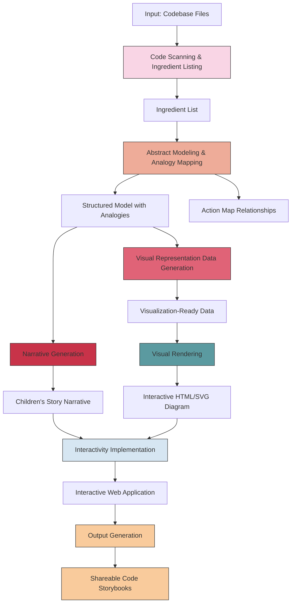
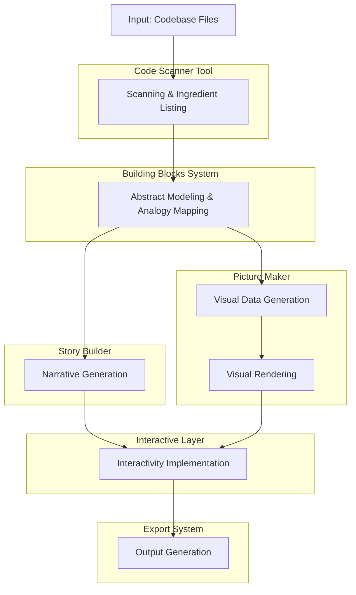
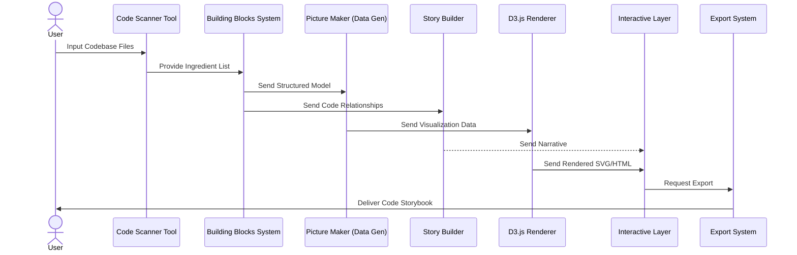
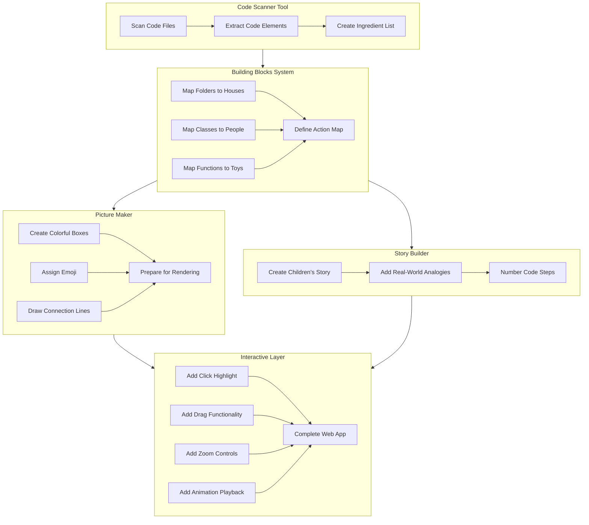
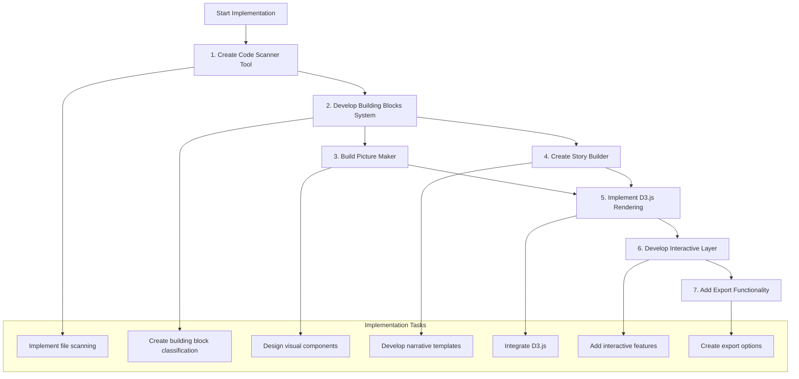

# Super Simple Code Framework Visualizer - Process Flow Diagrams

## Process Flowchart

## Component Swimlane Diagram

## Data Flow Diagram

```mermaid
flowchart LR
    Source[Codebase Files] --> Scanner
    
    Scanner[Code Scanner Tool] --> |Houses, People, Toys, Connections| ModelingSystem
    
    ModelingSystem[Building Blocks System] --> |Structured Model with Analogies| VisualGenerator
    ModelingSystem --> |Code Flow & Relationships| StoryBuilder
    
    VisualGenerator[Picture Maker] --> |Visualization Data| Renderer
    StoryBuilder[Story Builder] --> |Narrative Text| InteractiveLayer
    
    Renderer[D3.js Renderer] --> |HTML/SVG Diagram| InteractiveLayer
    
    InteractiveLayer[Interactive Layer] --> |Interactive Application| ExportSystem
    
    ExportSystem[Export System] --> |Shareable HTML| FinalOutput[Code Storybooks]
```

## Sequence Diagram

## Detailed Component Diagram

## Implementation Steps Flowchart

