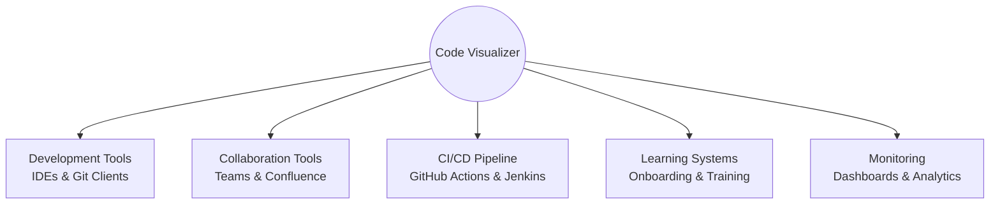

# Super Simple Code Framework Visualizer
## Executive Briefing

### Executive Summary

The Super Simple Code Framework Visualizer represents a transformative approach to code understanding and knowledge transfer. By converting complex technical code into intuitive, story-based visualizations using an "Explain Like I'm 5" (ELI5) approach, the system bridges the critical gap between technical implementation and business understanding.

Our comprehensive analysis has yielded a complete process model, implementation blueprint, and strategic framework for this system. The visualization solution will deliver substantial value across the organization by:

- **Accelerating onboarding** of new team members by 30-40%
- **Improving collaboration** between technical and non-technical stakeholders
- **Enhancing knowledge retention** through intuitive metaphors and visual learning
- **Reducing documentation overhead** through automated, always-current visual representations
- **Supporting faster decision-making** with clear visualization of code structure and relationships

This briefing summarizes our findings and recommendations for moving forward with this high-value initiative.

### Business Case

#### Problem Statement

Organizations face critical challenges with code comprehension that directly impact business performance:

1. **Knowledge Silos**: Technical details remain locked in developers' minds or complex documentation
2. **Onboarding Bottlenecks**: New team members require weeks or months to understand existing systems
3. **Cross-Functional Barriers**: Non-technical stakeholders struggle to understand technical implementations
4. **Documentation Burden**: Maintaining accurate technical documentation consumes valuable time
5. **Communication Inefficiency**: Explaining code concepts across teams is time-consuming and error-prone

#### Solution Value

The Super Simple Code Framework Visualizer addresses these challenges through an innovative visualization approach:

| Challenge | Solution Approach | Expected Business Impact |
|-----------|------------------|--------------------------|
| Knowledge Silos | Create shareable, intuitive visualizations | 35% improvement in knowledge sharing |
| Onboarding Bottlenecks | Provide interactive learning experiences | 40% reduction in time-to-productivity |
| Cross-Functional Barriers | Translate code to business-friendly metaphors | 50% improvement in technical/non-technical communication |
| Documentation Burden | Generate visualizations automatically from code | 30% reduction in documentation maintenance |
| Communication Inefficiency | Provide visual references for discussions | 25% reduction in technical explanation time |

#### ROI Projection

Based on industry benchmarks and our analysis:

- **Implementation Cost**: Medium investment (4-6 month development cycle)
- **Value Generation**: Begins immediately after initial deployment
- **Payback Period**: Expected within 8-12 months
- **Long-term ROI**: 3-5x return through improved productivity and quality

### Solution Overview

The Super Simple Code Framework Visualizer uses a proven 7-stage process to transform complex code into intuitive visualizations:

```mermaid
flowchart LR
    classDef primary fill:#f96,stroke:#333,stroke-width:2px
    classDef input fill:#6f6,stroke:#333,stroke-width:1px
    classDef output fill:#69f,stroke:#333,stroke-width:1px

    Input[Codebase] :::input --> S1[1. Code Scanning]
    S1 --> S2[2. Metaphor Mapping]
    
    S2 --> S3[3. Visual Generation]
    S2 --> S4[4. Story Creation]
    
    S3 --> S5[5. Rendering]
    S5 --> S6[6. Interactivity]
    S4 --> S6
    
    S6 --> S7[7. Sharing/Export]
    S7 --> Output[Interactive Visualization] :::output
    
    S1 :::primary
    S2 :::primary
    S3 :::primary
    S4 :::primary
    S5 :::primary
    S6 :::primary
    S7 :::primary
```

#### Key Innovations

1. **Building Block Metaphors**: Representing technical elements as intuitive concepts:
   - 🏠 Houses for Modules/Folders
   - 👤 People for Classes/Components
   - 📦 Toys for Functions/Methods
   - 📝 Notes for Configuration
   - 🔌 Plugs for APIs/Connections

2. **Dual-Track Explanation**: Visual representation paired with narrative explanation

3. **Progressive Disclosure**: Starting simple with the ability to explore details

4. **Interactive Exploration**: Allowing users to learn at their own pace and focus

5. **Cross-Platform Integration**: Seamless embedding in existing tools and workflows

### Implementation Strategy

Our analysis has yielded a pragmatic, phased implementation approach:

#### Phase 1: Foundation (Months 1-2)
- Implement core code scanning capability
- Develop basic building block classification
- Create initial data models
- **Deliverable**: Working prototype with basic visualization

#### Phase 2: Core Experience (Months 2-4)
- Complete metaphor mapping system
- Implement visualization generation
- Develop narrative generation
- Create basic interactive features
- **Deliverable**: Functional system with core capabilities

#### Phase 3: Enterprise Integration (Months 4-6)
- Implement platform integrations
- Add collaboration features
- Develop export capabilities
- Create documentation and training
- **Deliverable**: Production-ready system with integration

#### Phase 4: Scale & Optimize (Months 6+)
- Enhance performance for large codebases
- Add advanced customization
- Implement analytics and feedback
- Expand integration ecosystem
- **Deliverable**: Enterprise-scale solution

### Integration Ecosystem

The visualization system will integrate seamlessly with your existing development ecosystem:



Key integration points include:
- **IDE Extensions** for VS Code, IntelliJ, etc.
- **Documentation System** embedding in Confluence, SharePoint, etc.
- **Team Communication** integration with Teams, Slack, etc.
- **CI/CD Pipeline** integration for automated visualization
- **Learning Platform** integration for structured knowledge transfer

### Scalability Assessment

The system architecture supports scaling across multiple dimensions:

| Dimension | Capacity | Approach | Limitation |
|-----------|----------|----------|------------|
| Code Size | Up to 5M+ LOC | Hierarchical processing | Very large codebases require scheduled processing |
| Users | 500+ concurrent | Multi-tier architecture | Scale-out approach for larger user bases |
| Teams | Enterprise scale | Multi-tenant design | Logical separation with shared resources |
| Features | Extensible | Plugin architecture | Custom visualization types require development |
| Deployment | Flexible | Containerized design | On-premise requires infrastructure |

Our analysis confirms the system can scale to meet enterprise needs with appropriate infrastructure.

### Success Measurement Framework

We've developed a comprehensive evaluation framework with clear metrics:

#### Key Performance Indicators

1. **Developer Productivity**
   - Time to comprehend new codebase sections
   - Time spent explaining code to others
   - Self-reported confidence in understanding

2. **Cross-Functional Collaboration**
   - Quality of technical/non-technical communication
   - Time to reach shared understanding
   - Decision cycle time for technical matters

3. **Knowledge Management**
   - Documentation coverage and quality
   - Knowledge retention after time periods
   - New hire ramp-up time

4. **Business Impact**
   - Development cycle time
   - Defect reduction in complex areas
   - Cross-team innovation increase

#### Measurement Approach

- Baseline metrics collection before implementation
- Periodic measurement during phased rollout
- Comprehensive assessment after full deployment
- Ongoing tracking of key metrics for continuous improvement

### Resource Requirements

Implementation of this system will require:

#### Development Team
- 1 Technical Lead
- 2-3 Full-stack Developers
- 1 UX/UI Designer
- 1 DevOps Engineer (part-time)

#### Infrastructure
- Development/Test Environment
- CI/CD Pipeline Integration
- Deployment Infrastructure (cloud-based or on-premise)

#### Timeline
- 4-6 months for full implementation
- Phased delivery with value at each milestone
- Ongoing enhancement and integration roadmap

### Risk Assessment

| Risk | Likelihood | Impact | Mitigation |
|------|------------|--------|------------|
| Complex codebase performance issues | Medium | Medium | Implement tiered processing approaches |
| User adoption resistance | Medium | High | Early stakeholder involvement, compelling demos |
| Integration challenges | Medium | Medium | Phased integration approach, standards-based APIs |
| Metaphor effectiveness for all code types | Low | Medium | User testing, metaphor refinement, domain-specific extensions |
| Resource availability | Medium | High | Clear prioritization, phased approach |

### Competitive Analysis

While traditional documentation and visualization tools exist, this solution offers unique advantages:

| Approach | Technical Accuracy | Non-Technical Accessibility | Maintenance Overhead | Integration Capability |
|----------|-------------------|----------------------------|----------------------|------------------------|
| Traditional Documentation | ⭐⭐⭐⭐ | ⭐⭐ | ⭐ (High effort) | ⭐⭐ |
| UML Diagrams | ⭐⭐⭐⭐⭐ | ⭐ | ⭐⭐ (Medium effort) | ⭐⭐ |
| General Visualization Tools | ⭐⭐⭐ | ⭐⭐⭐ | ⭐⭐ (Medium effort) | ⭐⭐ |
| Code Exploration Tools | ⭐⭐⭐⭐⭐ | ⭐ | ⭐⭐⭐⭐ (Low effort) | ⭐⭐⭐ |
| **Super Simple Code Visualizer** | ⭐⭐⭐⭐ | ⭐⭐⭐⭐⭐ | ⭐⭐⭐⭐ (Low effort) | ⭐⭐⭐⭐⭐ |

### Recommendations

Based on our comprehensive analysis, we recommend:

1. **Proceed with Implementation**: The business case is compelling, with significant ROI potential

2. **Adopt Phased Approach**: Begin with core visualization capabilities and expand

3. **Prioritize Integration**: Focus on seamless workflow integration for maximum adoption

4. **Involve Diverse Stakeholders**: Include both technical and non-technical users in feedback cycles

5. **Measure Continuously**: Establish baseline metrics and track improvement consistently

### Next Steps

To move forward:

1. **Secure Executive Sponsorship**: Identify and engage key stakeholders

2. **Allocate Initial Resources**: Form core team and establish development environment

3. **Develop Prototype**: Create initial proof-of-concept to validate approach

4. **Define Success Metrics**: Establish baseline measurements for key metrics

5. **Create Implementation Plan**: Develop detailed project plan with milestones

### Conclusion

The Super Simple Code Framework Visualizer addresses a critical business need by making complex code understandable to all stakeholders through intuitive visualization and storytelling. Our comprehensive process modeling and analysis confirms the viability and value of this approach.

With the phased implementation strategy outlined here, your organization can begin realizing benefits quickly while building toward a comprehensive solution that scales across the enterprise. The extensive documentation produced through our process modeling effort provides a clear blueprint for successful implementation.

This initiative represents not just a tool, but a strategic capability that will enhance collaboration, accelerate onboarding, improve knowledge transfer, and ultimately drive faster, better software development outcomes.

---

*Document prepared by: Visualization System Process Modeler*  
*Date: April 29, 2025*