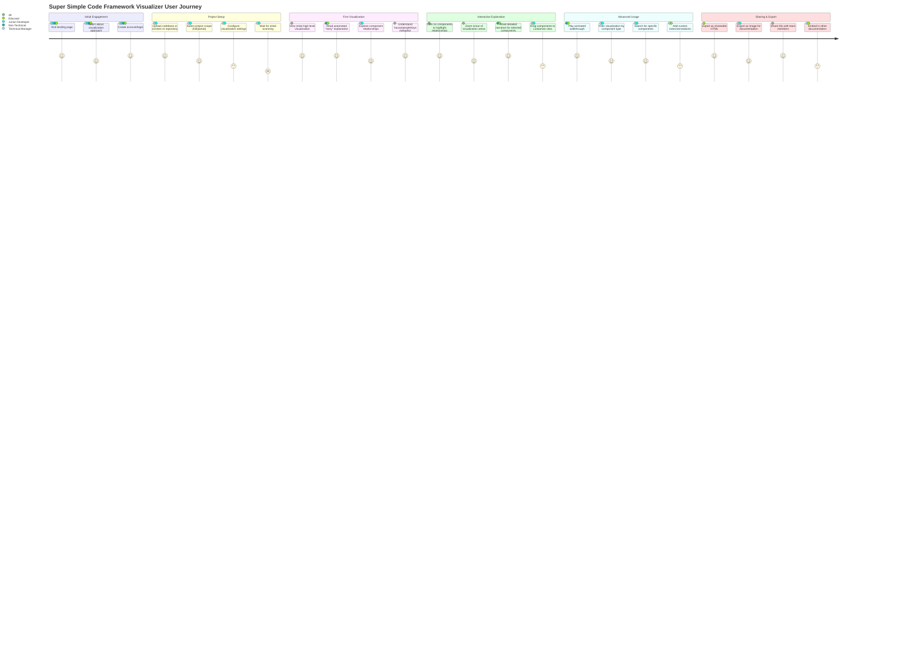
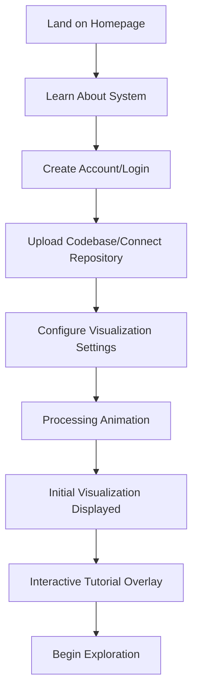
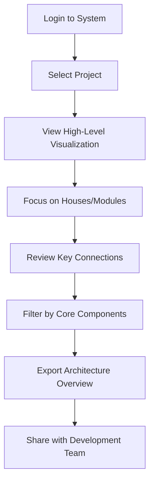
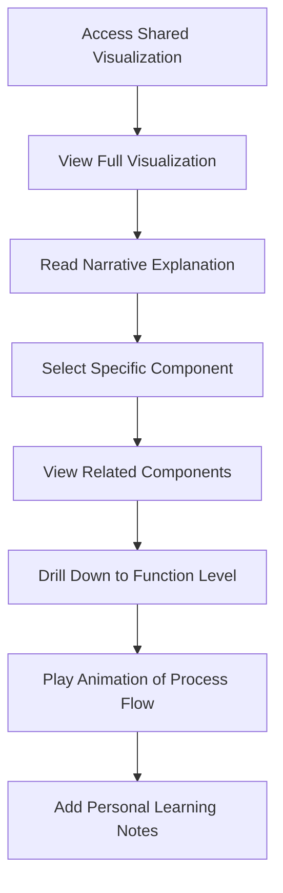
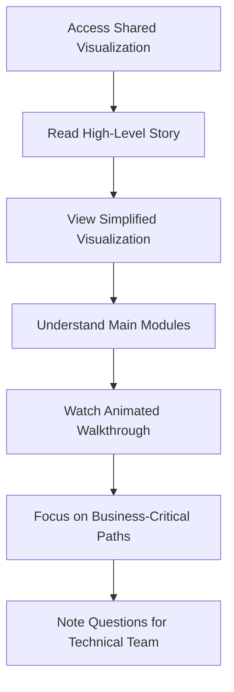
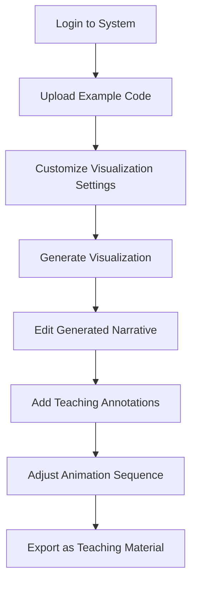

# Super Simple Code Framework Visualizer - User Journey

This document maps the end-user experience when interacting with the Super Simple Code Framework Visualizer, highlighting key touchpoints and usage scenarios.

## User Personas

### 1. Technical Manager
**Profile:** Has technical background but needs to quickly understand a new codebase to make strategic decisions.  
**Goals:** Gain high-level understanding of system architecture and component relationships without diving into code details.

### 2. Junior Developer
**Profile:** New to the team or project, needs to understand existing code.  
**Goals:** Learn how the codebase works, understand relationships between components, and identify where to make changes.

### 3. Non-Technical Stakeholder
**Profile:** Product owner, business analyst, or other non-technical team member.  
**Goals:** Understand general system functionality without needing to comprehend code specifics.

### 4. Educator
**Profile:** Teaching programming concepts to students.  
**Goals:** Create visual explanations of code structures and processes for educational materials.

## User Journey Map

## Detailed User Flows

### 1. First-Time Visualization Flow

### 2. Technical Manager - Architecture Review Flow

### 3. Junior Developer - Learning Flow

### 4. Non-Technical Stakeholder - Understanding Flow

### 5. Educator - Teaching Material Creation Flow

## Key Interaction Touchpoints

### 1. Codebase Input Interface

**User Experience Goals:**
- Simple, intuitive file upload or repository connection
- Clear progress indicators during processing
- Preview capability for large codebases
- Configuration options that don't overwhelm

**Design Considerations:**
- Drag-and-drop file upload area
- GitHub/GitLab integration buttons
- Progress bar with time estimate
- Basic/Advanced toggle for configuration options

### 2. Initial Visualization View

**User Experience Goals:**
- Immediate comprehension of high-level structure
- Clear visual distinction between component types
- Non-overwhelming initial view
- Obvious starting points for exploration

**Design Considerations:**
- Automatically zoomed to fit entire visualization
- Pulse animation on suggested starting points
- Simplified initial view with expansion options
- Welcoming narrative overlay explaining what you're seeing

### 3. Interactive Exploration Controls

**User Experience Goals:**
- Intuitive navigation and interaction
- Progressive disclosure of details
- Seamless switching between visualization and narrative
- Responsive feedback for all user actions

**Design Considerations:**
- Familiar zoom/pan controls (mouse wheel, pinch)
- Hover states with preview information
- Sidebar toggle for detailed narrative
- Animation controls similar to video players
- Component search with predictive suggestions

### 4. Narrative Display

**User Experience Goals:**
- Age-appropriate explanation style (ELI5)
- Connection between text and visual elements
- Progressive narrative that builds understanding
- Technical accuracy despite simplified language

**Design Considerations:**
- Synchronized highlighting between text and visualization
- Tabbed view for different explanation styles/depths
- Voice narration option with highlighting
- Glossary for introduced concepts/terms

### 5. Export and Sharing Interface

**User Experience Goals:**
- Multiple format options for different use cases
- Simple sharing with non-system users
- Control over what is included in exports
- Preview before finalizing

**Design Considerations:**
- Format selection with use case recommendations
- Permission/access controls for shared visualizations
- Export customization (components, narrative, annotations)
- Direct integration with common documentation systems

## User Experience Optimization Opportunities

### 1. Personalization

- **User Preference Memory**: Remember zoom levels, component focus, and view preferences
- **Complexity Adjustment**: Allow users to set explanation complexity based on their technical level
- **Custom Color Schemes**: Support user-defined themes and accessibility options
- **Saved Views**: Enable saving specific perspective configurations for quick access

### 2. Progressive Learning Path

- **Guided Tours**: Create structured exploration paths through complex codebases
- **Knowledge Checkpoints**: Optional quick quizzes to confirm understanding
- **Incremental Complexity**: Start with simplified views and gradually introduce more details
- **Bookmarking**: Allow users to mark components for later deeper review

### 3. Collaborative Features

- **Shared Annotations**: Enable team members to add notes and questions to visualizations
- **Discussion Threads**: Attach conversations to specific components or relationships
- **Live Collaboration**: Support multiple simultaneous viewers with cursor/focus indicators
- **Knowledge Base Connection**: Link components to internal documentation or wiki pages

### 4. Feedback Integration

- **Understanding Ratings**: Let users rate the clarity of explanations
- **Alternative Explanation Requests**: Allow users to request different analogy approaches
- **Suggestion System**: Enable users to propose better metaphors or explanations
- **Usage Analytics**: Track most viewed components to identify areas needing better documentation

## Success Metrics

### 1. Engagement Metrics

- Time spent interacting with visualizations
- Number of components explored per session
- Return visit frequency
- Feature usage distribution (narrative vs. visualization vs. animation)

### 2. Comprehension Metrics

- User-reported understanding improvement (surveys)
- Quiz/assessment performance (for educational implementations)
- Decrease in follow-up technical questions (for team implementations)
- Speed to first contribution (for new developers)

### 3. Practical Impact Metrics

- Reduction in onboarding time for new team members
- Increase in cross-functional collaboration
- Improved documentation quality and coverage
- Faster decision-making on architectural questions

## Conclusion

The Super Simple Code Framework Visualizer user journey emphasizes accessibility and progressive understanding for users of all technical levels. The system transforms the complex technical process of code visualization into an intuitive, story-driven experience that enables quick comprehension and effective knowledge sharing.

By focusing on user-centered design principles like the ELI5 approach, interactive exploration, and narrative-driven explanation, the system creates a unique learning experience that bridges the gap between technical implementation and conceptual understanding.

The detailed user flows and interaction touchpoints provide a blueprint for implementation that prioritizes user experience alongside technical accuracy, ensuring the system delivers value to all stakeholders interacting with codebases regardless of their technical expertise.